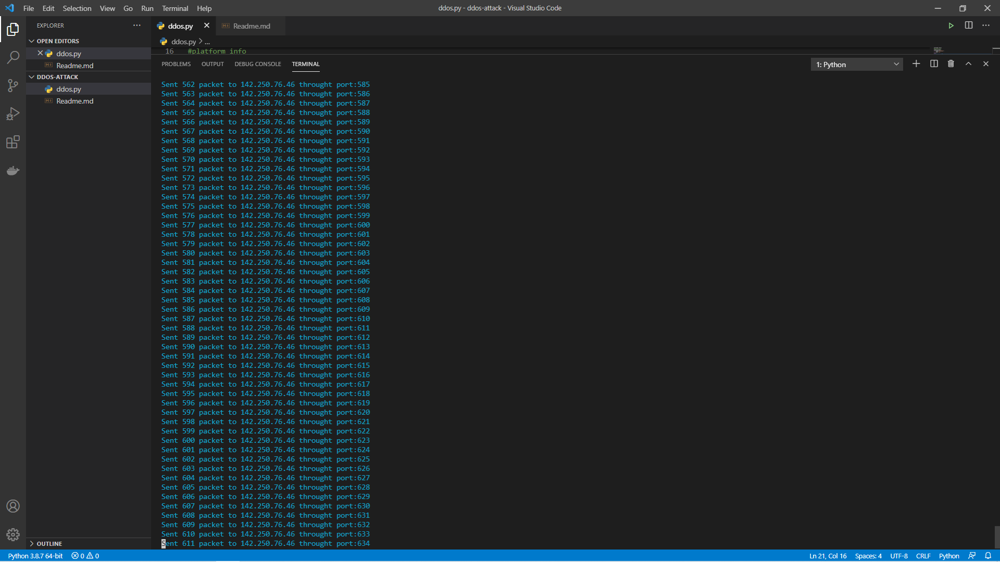

# Description

`` This script is written in python3 and used to do DDoS(Distributed Denial of Service) attack on a website. It will basically work when you run the script on your system(checkout supported systems below) and provide the websites domain or ip address and the port number from which you want to start sending packets and it will keep on sending resources to that site thus overwhelming it and finally not making it work. ``

### What is DDos Attack?
  In a distributed denial-of-service attack (DDoS attack), the incoming traffic flooding originates from many different sources. That effectively makes it impossible to stop the attack simply by blocking a single source.

### Supported Devices:
 This program is supported in all operating system like linux, windows and as the code is written in python3 so it works well without bug.

##Instructions for this python script to work : 👨🏻‍💻

### Step 1:

    Open Termnial 💻

### Step 2:

    Locate to the directory where its python file is located 📂

### Step 3:

    Run the command: python filename.py/python3 filename.py 🧐

### Step 4:

    Give the domain name or ip address and port number and click enter 💥

### Step 5:

    Sit back and Relax. Let the Script do the Job. ☕

### Step 6: 
    Click '3' or (ctrl + c) to quit else it will keep on sending packets 😅 

## Screenshot

