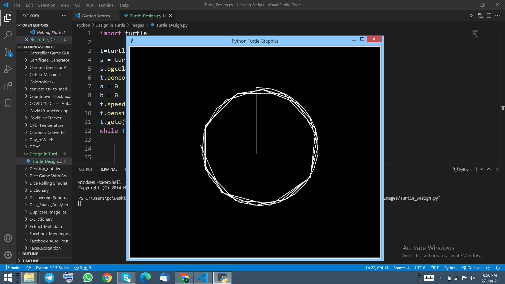
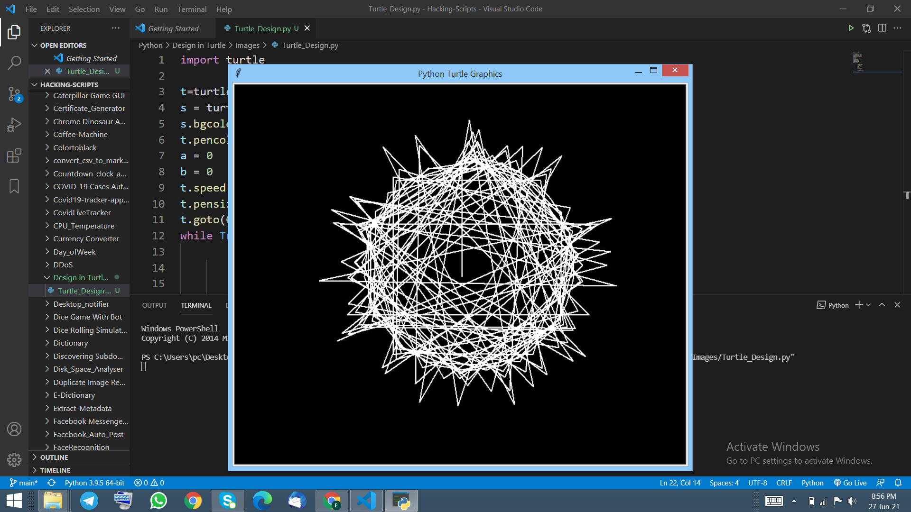
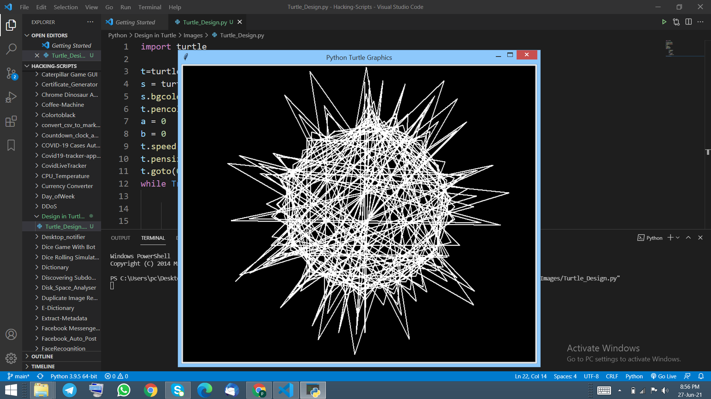

# Amazing design using turtle in python

## Introduction
This programme will show the power of equations that looks simple but when they go inside a loop they make wonders.

## How to install library
pip install turtle

## How to use
1. You has to install all the library mentioned above.
2. Run this programme in your command prompt or any terminal.
3. You will see a window in your screen which will be doing the work as specified by equation given to it.
4. After few seconds you can see the actual output in your screen.

## Output

