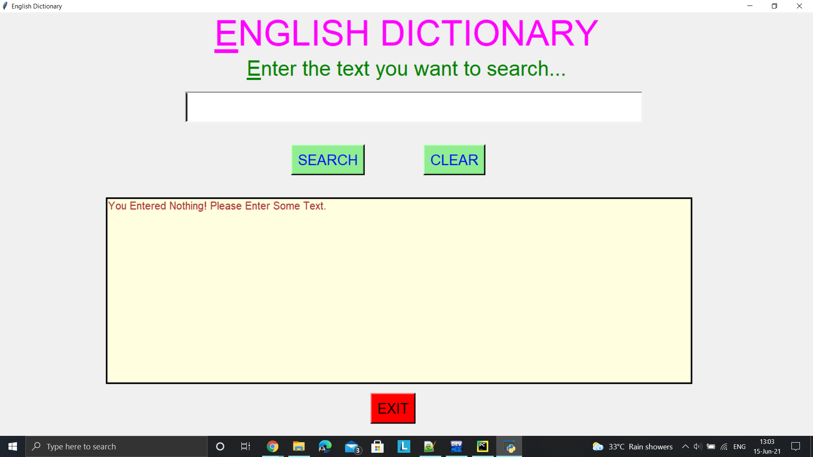
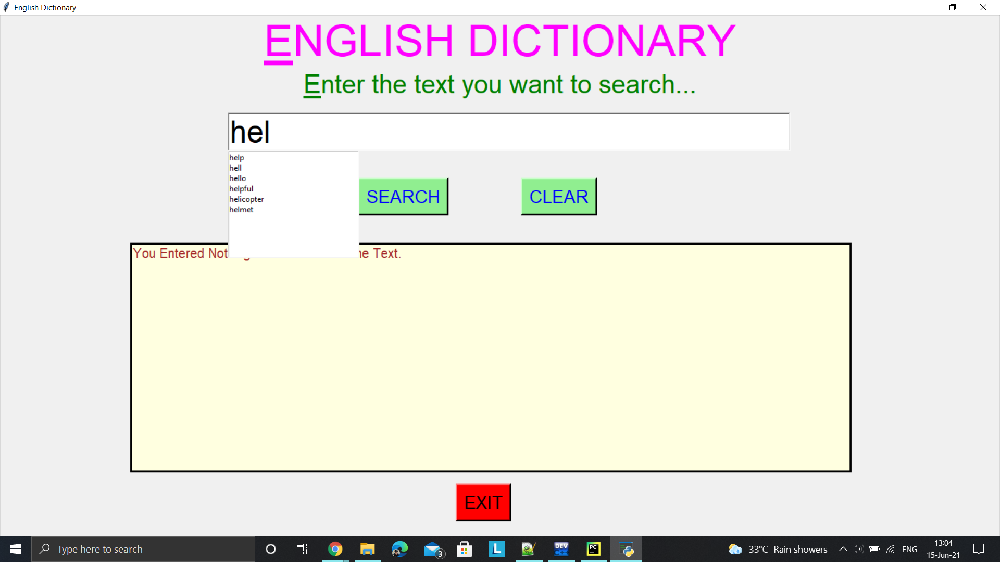
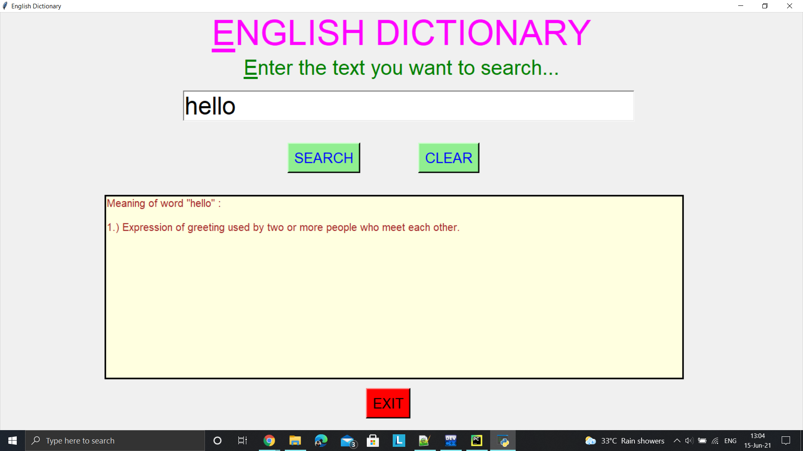
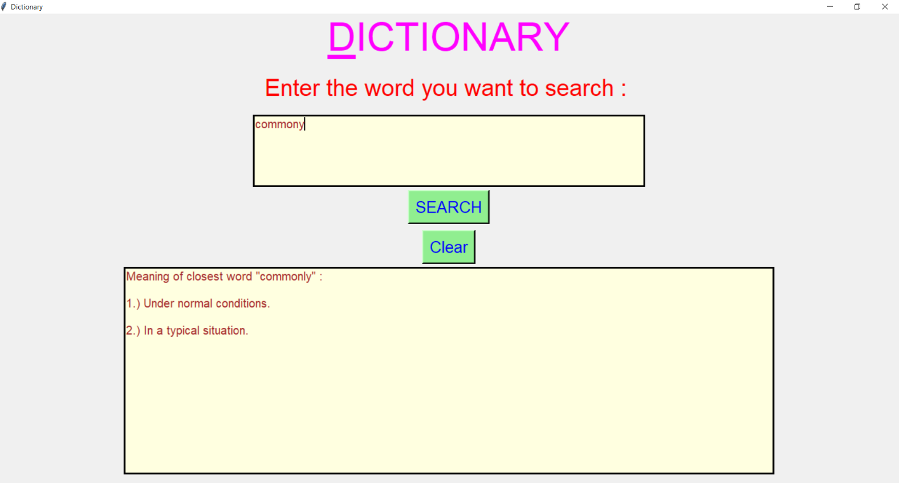
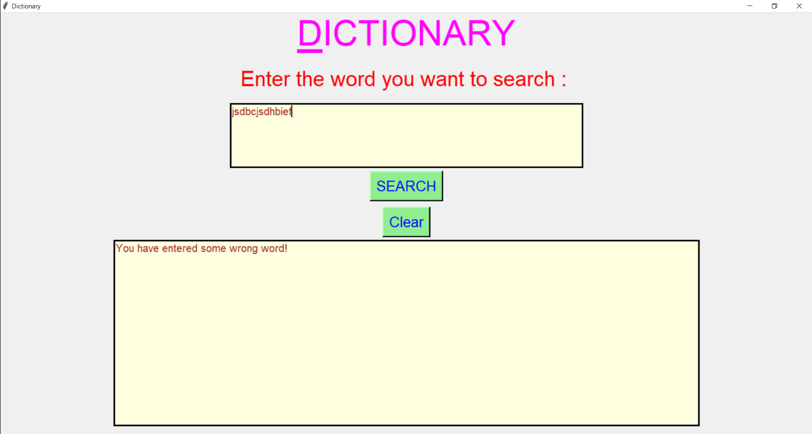

# ✔ Dictionary
- ### A dictionary created using json data file and tkinter GUI.
- ### Used data.json file and used those data importing json library.
- ### Also modified the code for the case of interface (word having multiple meaning), if word is title or noun,  and also developed the closest word matching technique in case of any typo.

****

   
   
   
   
   
   

****