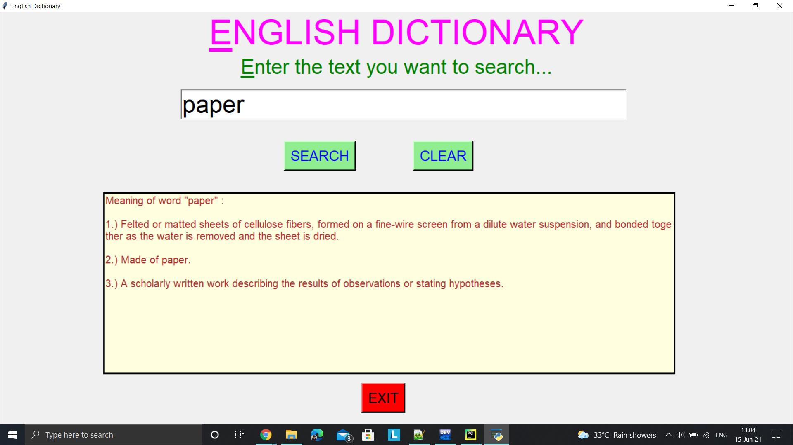
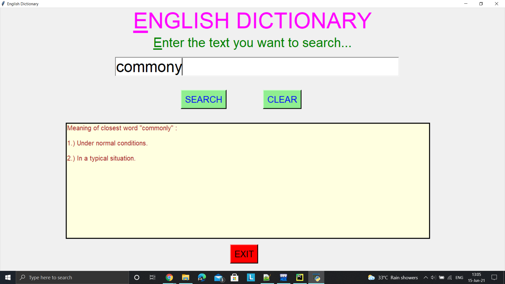

# ✔ Dictionary
- ### A dictionary created using json data file and tkinter GUI.
- ### Used data.json file and used those data importing json library.
- ### Also modified the code for the case of interface (word having multiple meaning), if word is title or noun,  and also developed the closest word matching technique in case of any typo.
- ### Added clear and exit button also.
- ### Used data (words.csv) - that contains the list of english words. Using this words.csv data, implemented the auto complete feature, i.e. as we enter any letter in the entry section, we get suggestion of words in dropdown list whose prefix matches with our entered word. 
- ### Also implemented the exit button such that, while exiting the dicctionary, we get a exit dialog box asking us the permission. 

****

## Libraries Used.
- ### io
- ### tkinter
- ### difflib
- ### pandas

****

## How to use it:
- ### Just download the files, and run the dictionary.py file.
- ### Then enter your text in the entry field and click on the search button, this will show meaning the below output textarea.
- ### While entrting the text, we can use select the word from the drop dow list suggested, if our word is there in drop down list.
- ### There is also an option to clear both the input and output field.
- ### And on clicking on the exit button, we get permission asking exit dialog box.

****

   
   
   
   
   
   
   
   

****