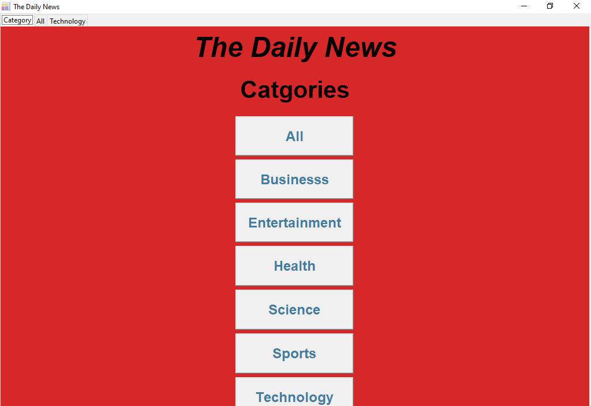

# The Daily News App
### About this application
- It is an application which provides you news.
- Is has a category tab from where you can read news according to the category.
- It also provide news link so that you can read full news.
- It uses **News API** to fetch news.


### How to use this app in your local machine
1. Go to this this link [News API](https://newsapi.org/) to get your API Key.
2. Get your API key by clicking on **Get API Key button** and complete registration.
3. Now, paste this API Key on **news_app.py** file on line number **9** or Where **YOUR_API_KEY**  is written.

### Requirements
- Your computer should have Python 3.
- You can download it from here [Download Python](https://www.python.org/downloads/)
- You need to install **requests** module.
- Type this in command prompt ```pip install requests```

### Screenshot of the application



