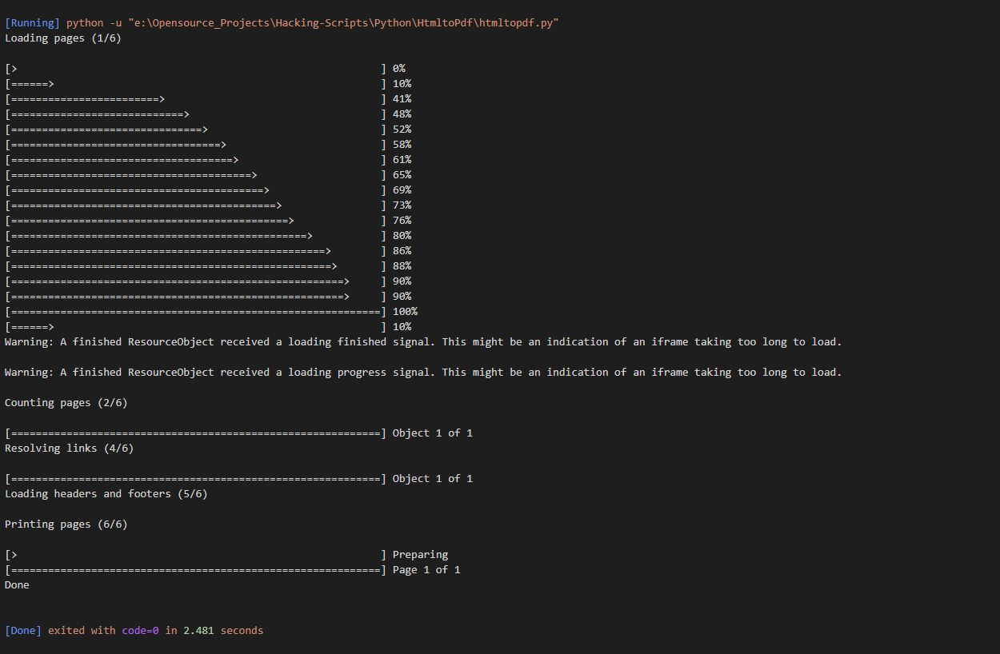
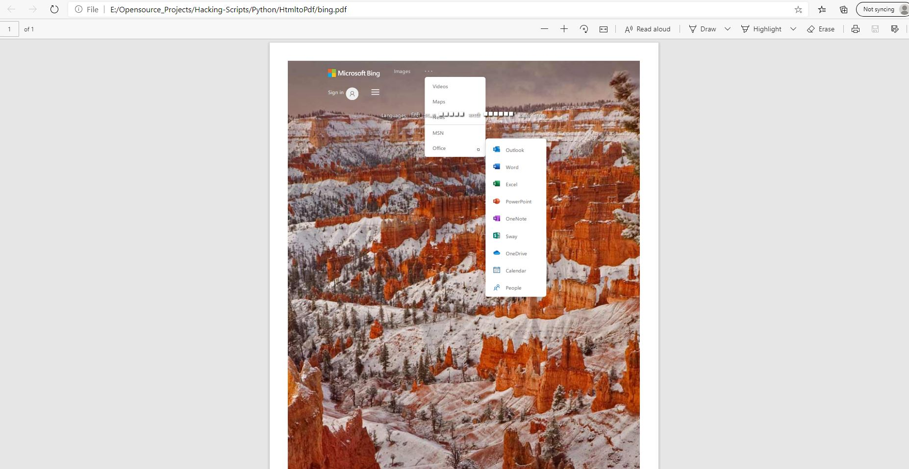

# Html to Pdf Generator

This is a python script written to convert any html page to pdf

## Steps to make it run

1. Clone/Download this repository
2. Install the requirements using the command
```
pip install -r requirements.txt
```
3. Download and Install wkhtmltopdf from https://wkhtmltopdf.org/downloads.html
4. Change the url in the python file to the url of your choice and run the file
5. Make sure the path of the executable file is same as in the script.If not change it as per your path.
6. You'll get the output file on the same folder as your repository

## Input 


## Output




