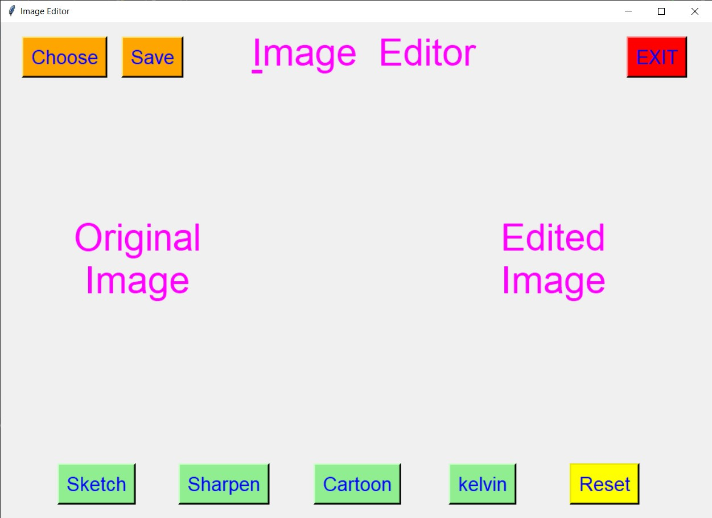
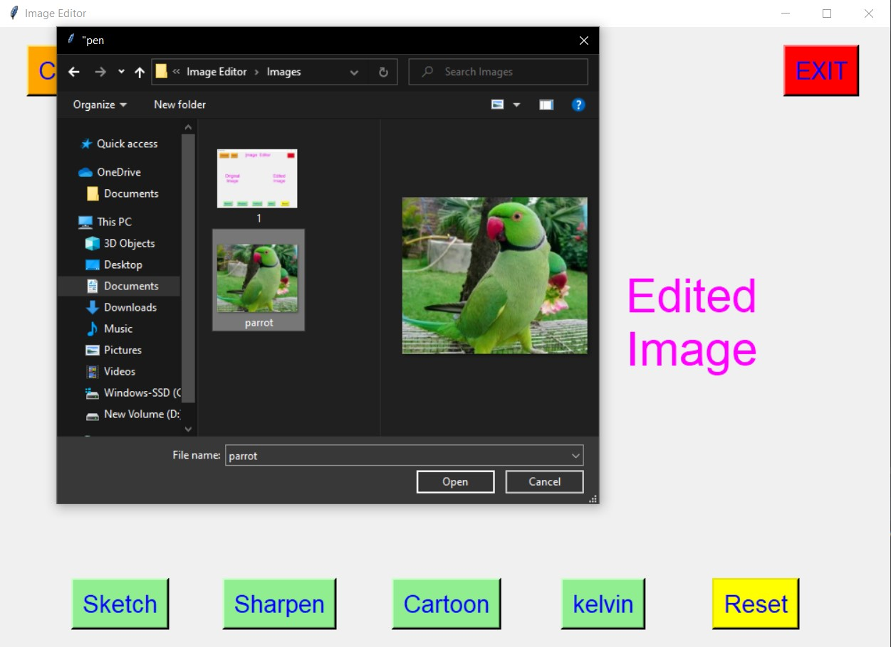
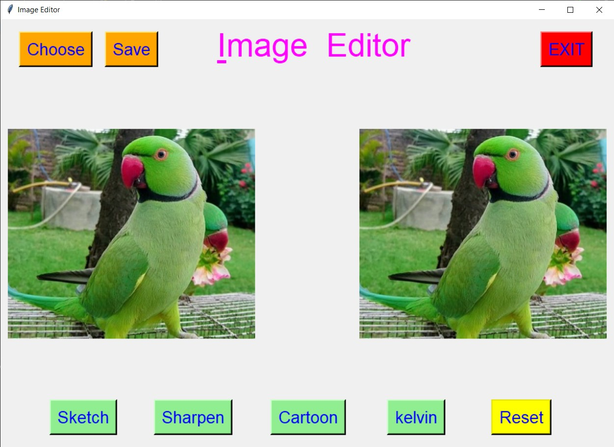
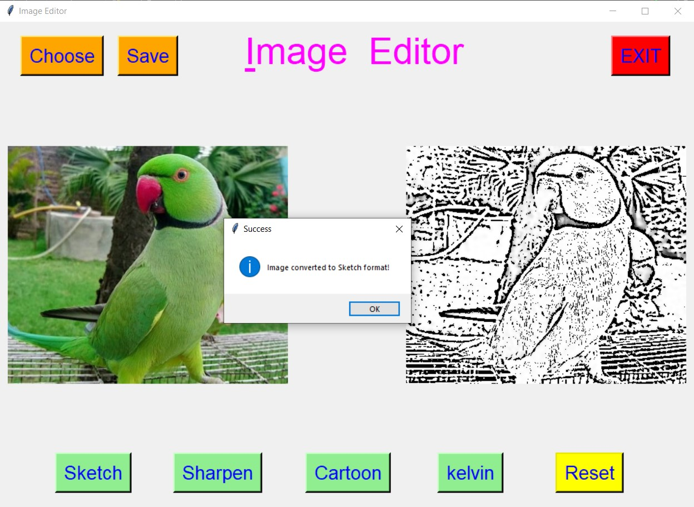
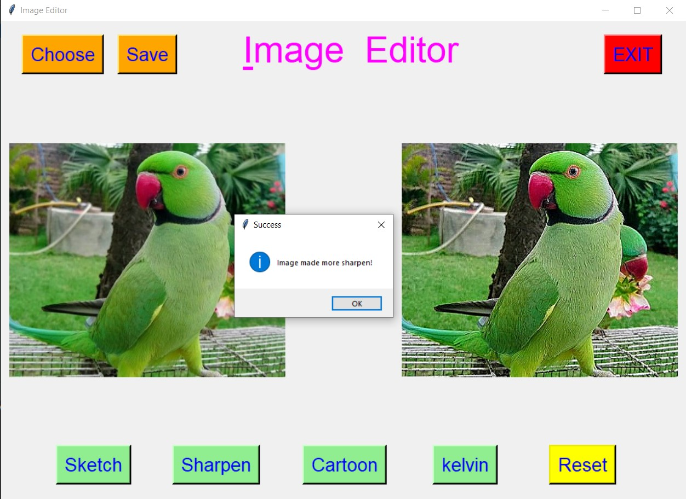
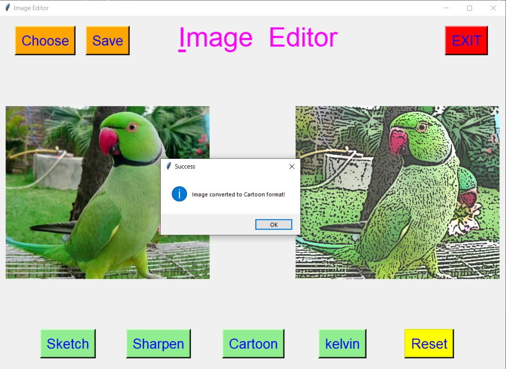
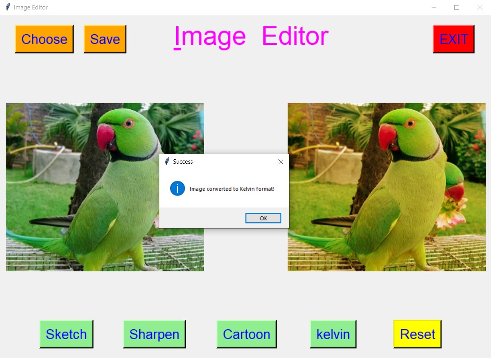
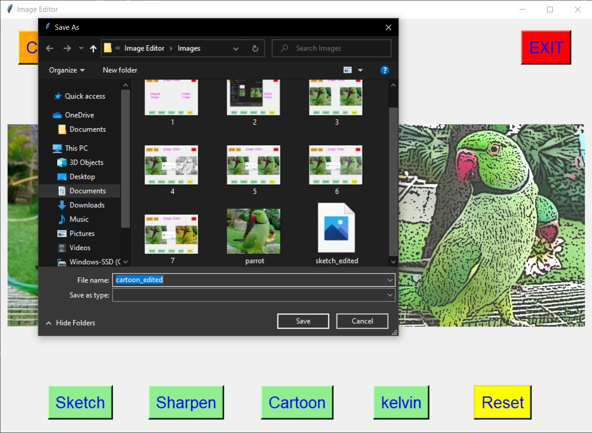
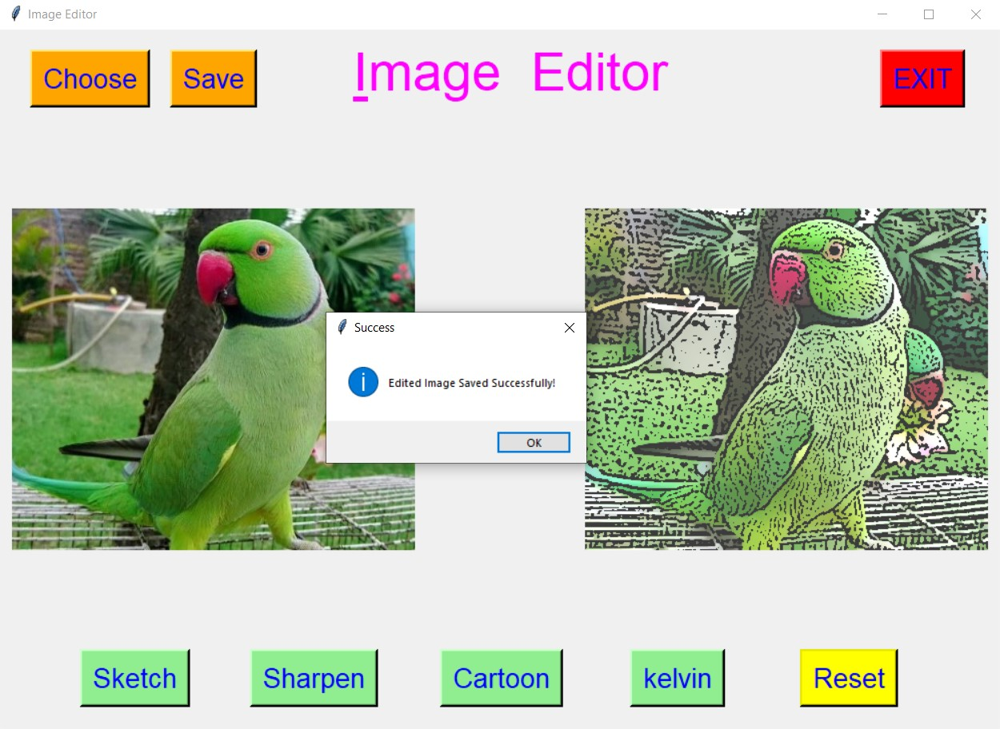
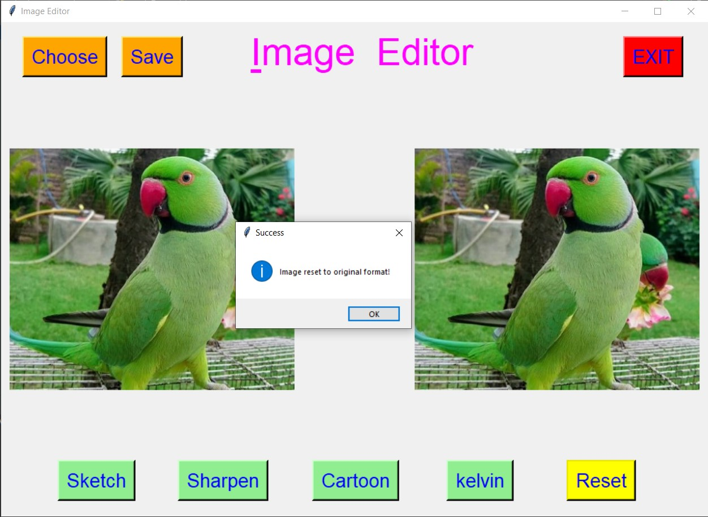

# ✔ IMAGE EDITOR
- ### An Image Editor is an image processing application created in python with tkinter gui and OpenCv library.
- ### In this application user can select an image and convert it to either Sketch, cartoon, make image more sharpen, convert to kelvin.
- ### Also after editing user can also save the edited image anywhere in the local system.
- ### Also there is option to reset to the original image.

****

# REQUIREMENTS :
- ### python 3
- ### os module
- ### cv2 module
- ### tkinter module
- ### filedialog from tkinter
- ### messagebox
- ### from PIL import Image, ImageTk
- ### numpy
- ### random

****

# HOW TO Use it :
- ### User just need to download the file, and run the image_editor.py, on local system.
- ### After running a GUI window appears, where user needs to choose an image file using CHOOSE button on the top right corner.
- ### After selecting the image, two images will appear on screen one on left side, which is original and one on write in which edited format will be shown.
- ### Now user can start editing user buttons Sketch, Cartoon, Sharpen and Kelvin and can visualize the changes in each.
- ### After editing user can also save the edited image to any location in local system using SAVE button.
- ### Also there is a RESET button, clicking on which resets the edited image to original format.
- ### Also there is exit button, clicking on which we get a exit dialog box asking the permission to exit.

# Purpose :
- ### This scripts helps us to easily edit the selected image to given format and also visualize the same.

# Compilation Steps :
1. Clone/Download this repository
```
git clone clone_path
```
2. Install the requirements using the command
```
pip install -r requirements.txt
```
3. Run the program using command
```
python image_editor.py
```
****

# Image Cartoonifier
 - Here we convert the simple image into cartoonified using cv library , here we first get the image then we change the grey scales and image shades so then the output carttonified image will be shown.
 - **Requirements** -> cv2 module
 - **How To Use It** ->Here we need an image for converting so get the image in to the script folder then run the script so the cartoonified image will be obtained ,here we can change the gray scale of the image as per our requirement.

# SCREENSHOTS :
****

<p align="center">
  <br>
  <br>
  <br>
  <br>
  <br>
  <br>
  <br>
  <br>
  <br>
  <br>
  <br>
</p>
 -> For Image Cartoonifier:

- real image


- Cartoonified image


****
