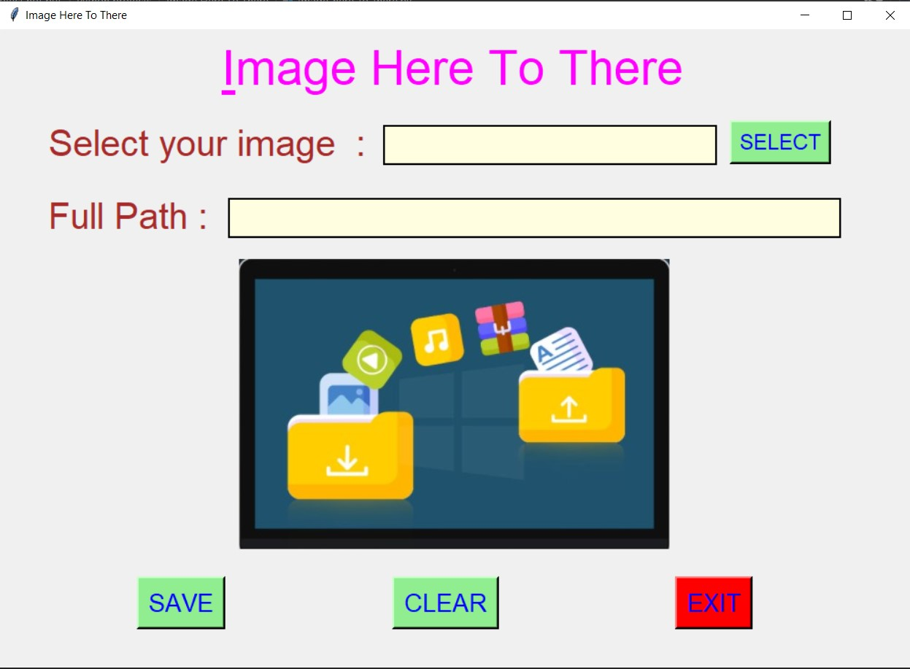
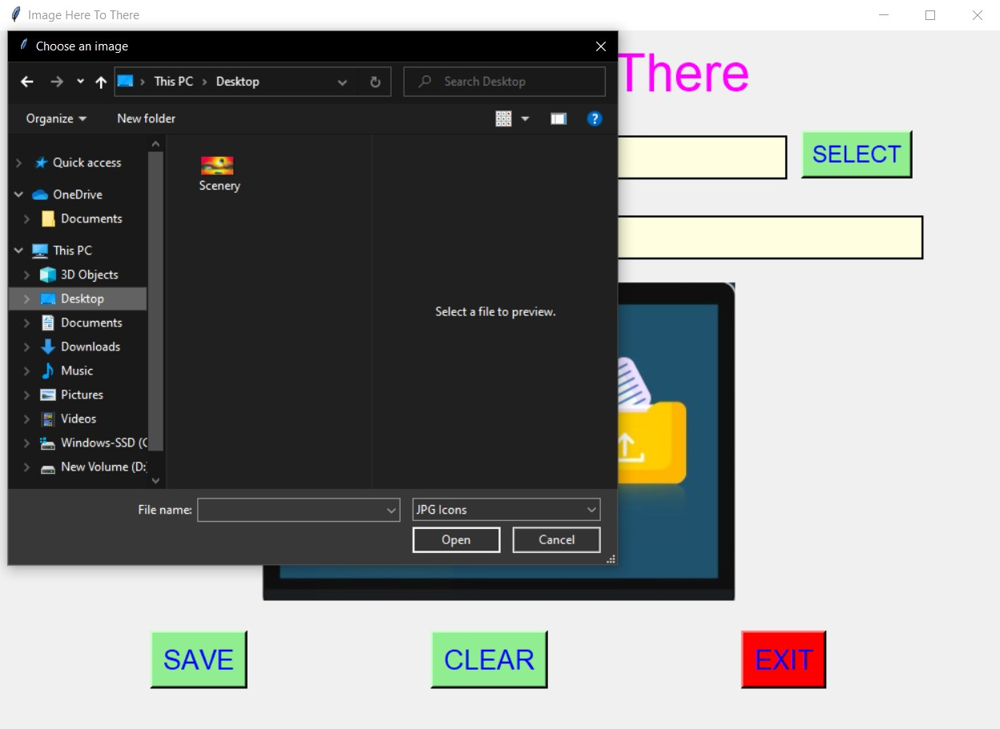
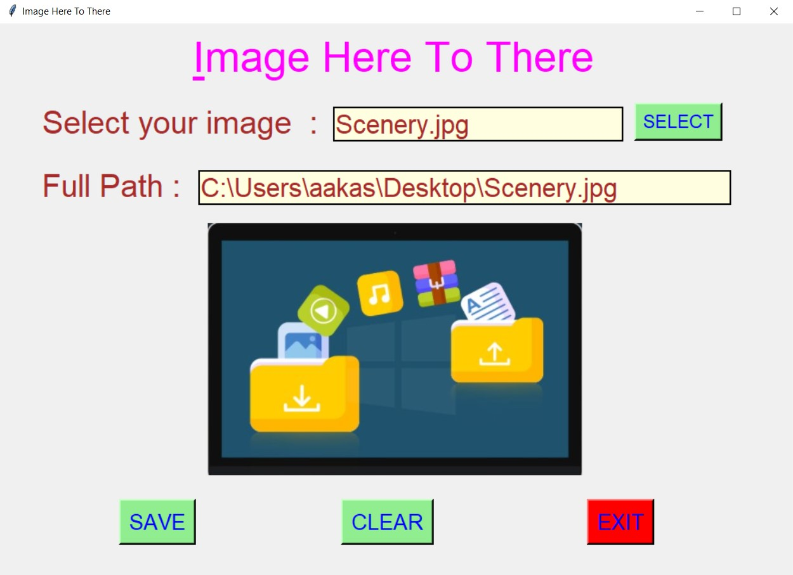
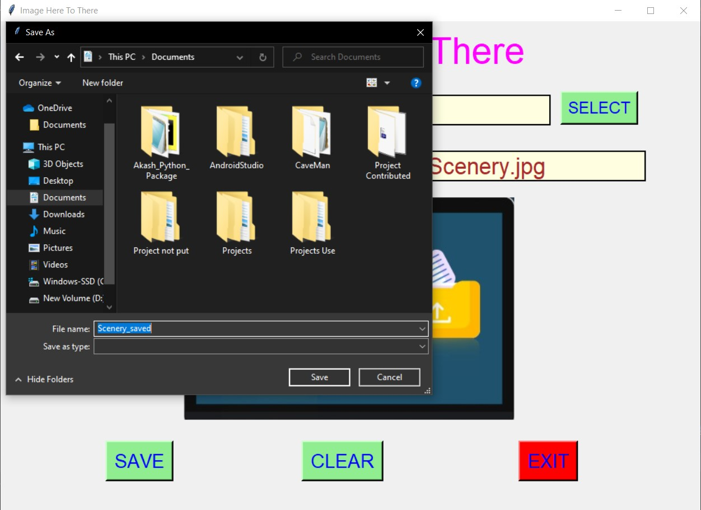
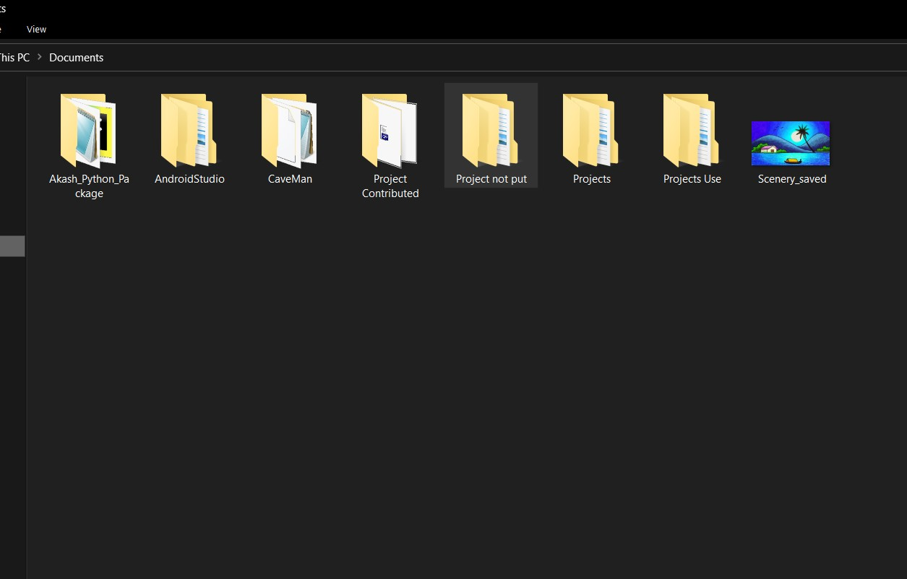
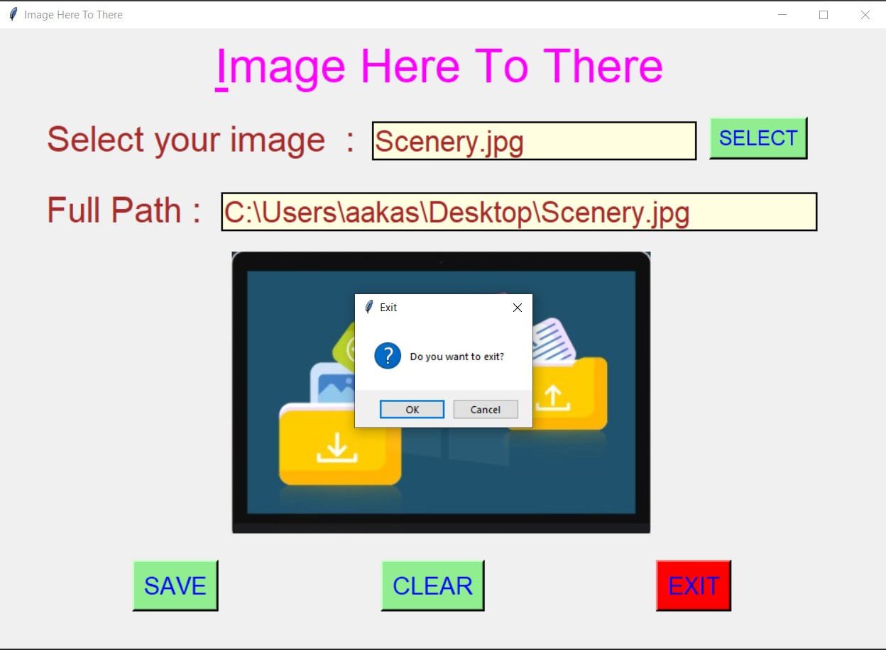

# ✔ IMAGE HERE TO THERE
- ### An Image Here To There is an image processing created in python with tkinter gui.
- ### In this application user can select any image from anywhere from the local system and save it to another place in our local system with any file name of our choice.
- ### Also user will be able to see the file path which he/she selected.

****

# REQUIREMENTS :
- ### python 3
- ### os module
- ### cv2 module
- ### tkinter module
- ### filedialog from tkinter
- ### messagebox
- ### from PIL import Image, ImageTk, ImageDraw

****

# HOW TO Use it :
- ### User just need to download the file, and run the image_here_to_there.py, on local system.
- ### After running a GUI window appears, click on SELECT and select image from the local system, which you want to save to another location.
- ### select the size from the drop down list.
- ### After user has selected the image, he/she will be able to see both file name and the full file path.
- ### Now user need to click on the SAVE button, using which user can save that image to any location with any filename user wants.
- ### After user has completed savind, a message will be shown like, File Saved Sucessfully.
- ### Also there is a CLEAR button, clicking on which clears both the text area.
- ### Also there is exit button, clicking on which we get a exit dialog box asking the permission to exit.

# Purpose :
- ### This scripts helps us to easily save file from one place to another using any filename.

# Compilation Steps :
1. Clone/Download this repository
```
git clone clone_path
```
2. Install the requirements using the command
```
pip install -r requirements.txt
```
3. Run the program using command
```
python image_here_to_there.py
```
****

# SCREENSHOTS :

****

<p align="center">
  <br>
  <br>
  <br>
  <br>
  <br>
  <br>
  <br>
</p>

****

# Below is sample video showing how application works :
<p align="center">
  <br>
</p>

****