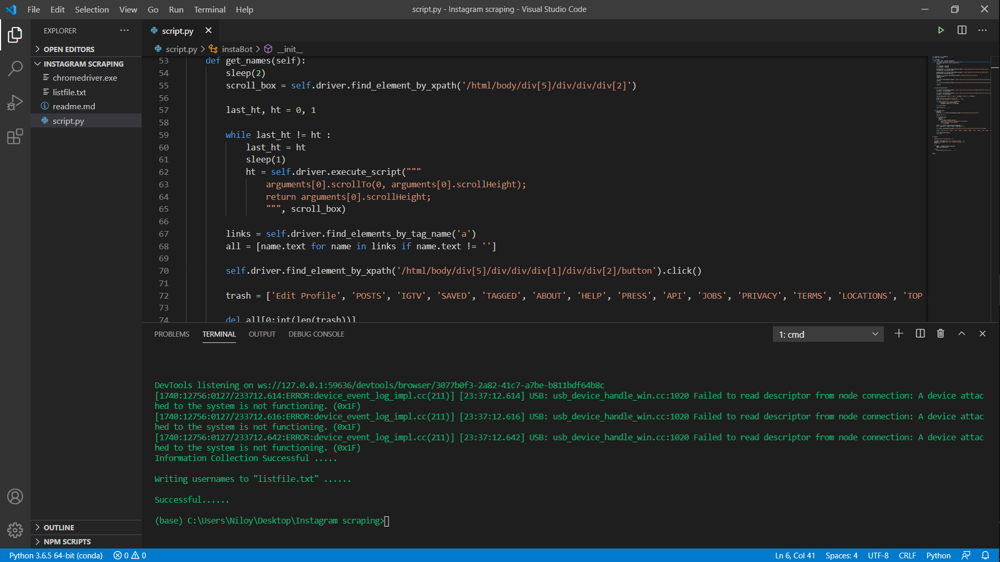

# 
 Instagram scraping script using selenium (to automate the task) 

## Introduction: 
Basically we don't have an option on Instagram to see the list of people whom we follow but they don't follow us back. If the number is large then it will be time-consuming as well as too much hard to find the perfect list. This is an Instagram scraping script using selenium(to automate the task) which will return us the desired list of usernames.
## Third-party libraries required:
The project requires `selenium` Library to be installed 
## Installing and Importing the Libraries:
Open Command Prompt on your computer and type the following:

`pip install selenium` - Allow the installation to get completed and then proceed  

### To import the libraries into the code
`from selenium import webdriver`  
`from time import sleep`  

## Running the Script:
After reaching the dirctory which contains the `script.py` file , hit "`python script.py`" in your terminal. 
Enter your Instagram username and password and then see the magic .

**Note:**
> You need the webdriver file. Download the chromedriver with the right version if you are using Google Chrome : https://chromedriver.chromium.org/downloads  . I am using the chromedriver for version87 . 
> Your data (username and password)  won't be stored into any kind of database . So feel safe to enter your credentials.

## Output:
#### The script will start a Chrome Window and there all the magic will happen . You don't need to do anything . After the completion of the script , it will generate a "listfile.txt" file into the same directory. Here you will get all the usernames whom you follow but they don't follow you back.  
 
**Follow me on <a href="https://github.com/Niloy-Sikdar-001">GitHub</a>**