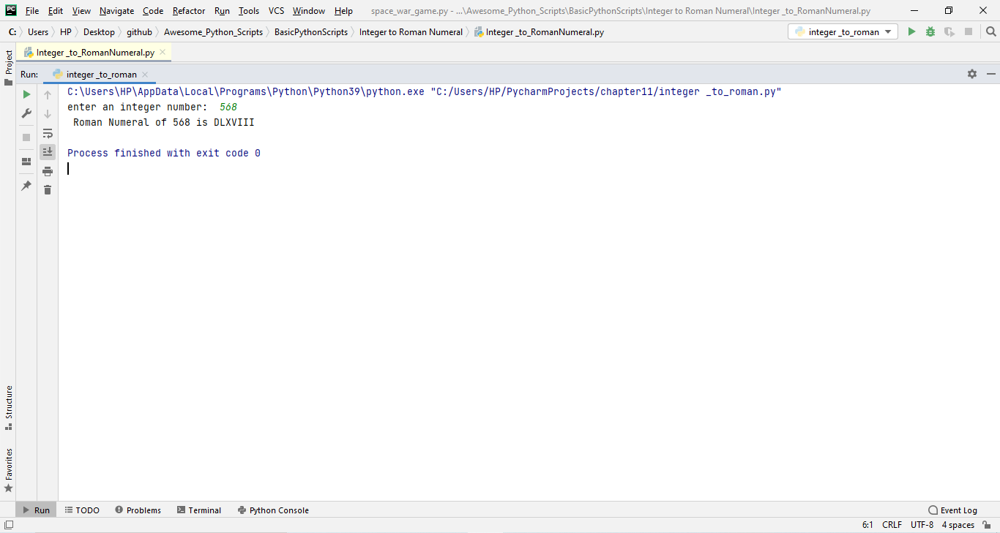

# Integer to Roman Numerals

***

## Description

Here,we need to convert integer to roman numerals we require two list first contain integer and second consist of roman numerals of respective integer.
Then we have to check the the range of value, divide the number with all values starting from zero.

***

## Third-Party Libraries Required:
No libraries required.

## Working ScreenShot

