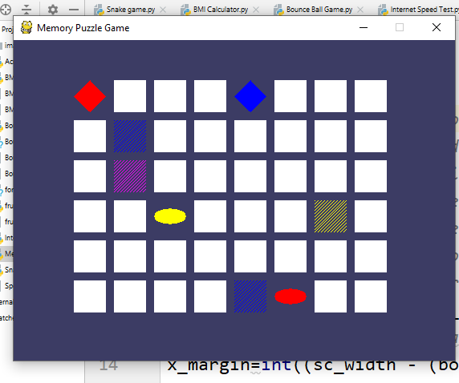
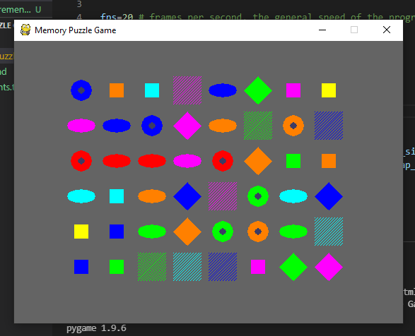

## MEMORY PUZZLE GAME 🧠❓🧩

## Description
It is a PyGame Python Script which will increase the focus and the remembering power of the player. It's a very popular game in which the screen is displayed having some images on it for a time of few seconds and the player has to rmember the position of those elements. The elements are in pair and we have o turn the similar elements consecutively. When the player turns all the images he/she wins the game. So, get ready for some brain exercises.🧩🧠

## How It Works?
In this game as soon as the player runs the code, game starts and the screeen will appear in which some images will be shown randomly for just few seconds. The images will be in pairs and the player has to use their mouse cursor and turn the similar blocks, if the pair is turned correctly they will get lock. The player has to keep trying and turn the similar blocks and get them locked. After all the blocks are turned correctly, the game will end and reset and now new game will start.

## Requirements
Python3 and import random,pygame,sys

## Screenshots

First Screen ❓🧠

Game End Screen 🧩

## Author:
Khushi Sharma