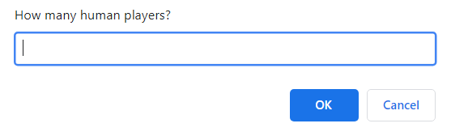
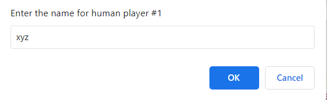
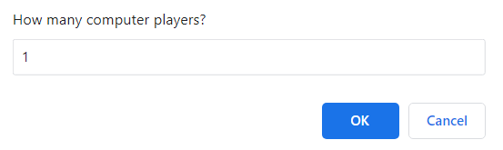
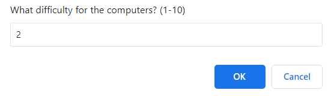
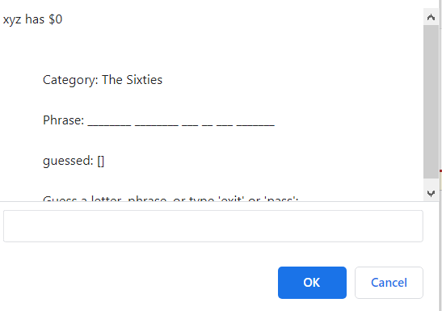
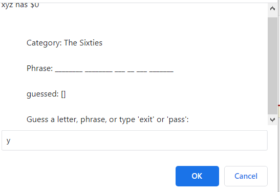
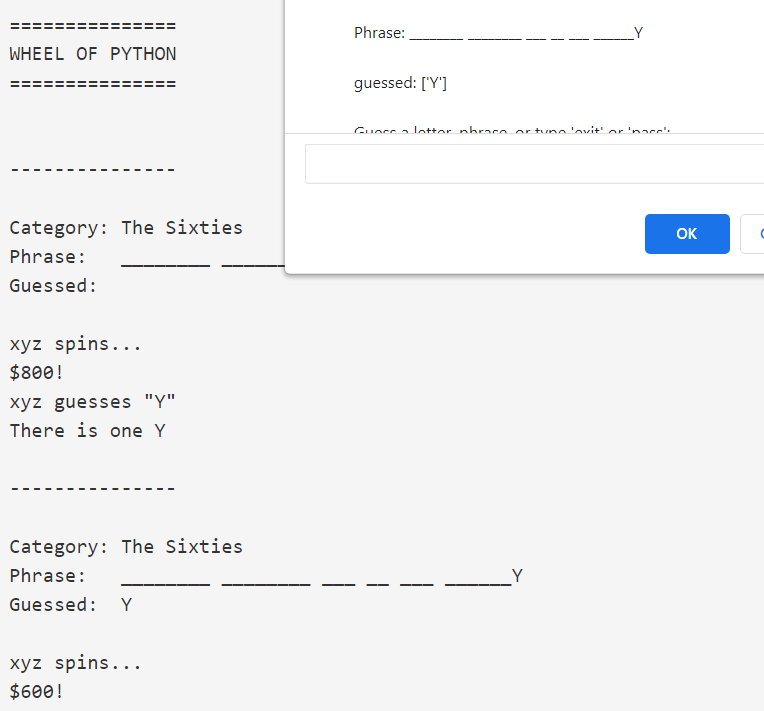

# Phrase Guessing Game

***

## Introduction

There's a phrase which is to be guessed appears on the window in the dashed format. Now, after that program asks for team member with whom you wish to play or play with computer. A random play wheel I have implemented. During their turn, every player spins the wheel to determine a prize amount and
a.) If the wheel lands on a cash square, players may do one of three actions:
1.) Guess any letter that hasn’t been guessed by typing a letter (a-z). Example: The user lands on $500 and guesses ‘W’
2.) Guess the complete phrase by typing a phrase.
b.) If the wheel lands on “lose a turn”, the player loses their turn and the game moves on to the next player.
c.) If the wheel lands on “bankrupt”, the player loses their turn and loses their money but they keep all of the prizes they have won so far.
The game continues until the entire phrase is revealed (or one player guesses the complete phrase).

***
## Input Image

## Output Image

## How to use: 

1. Run the script.
1. Enter information as asked.
1. Enjoy!

