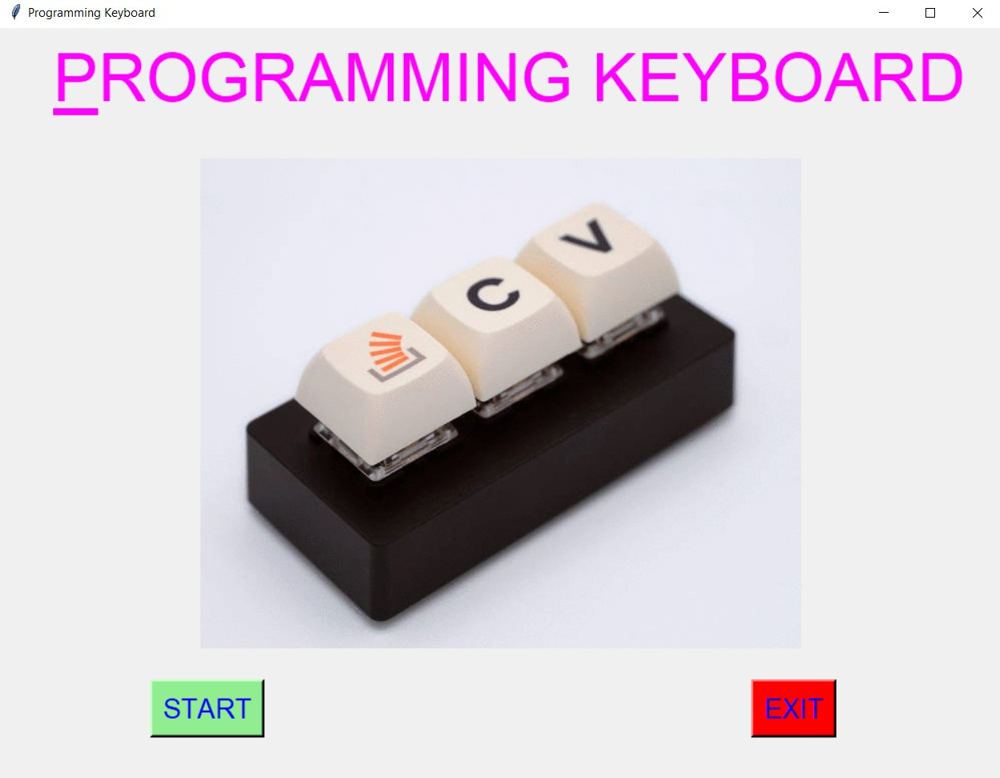
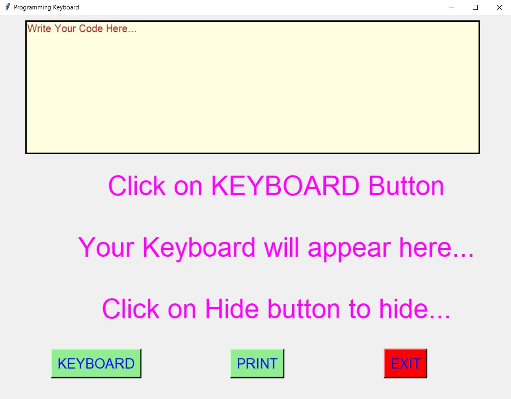
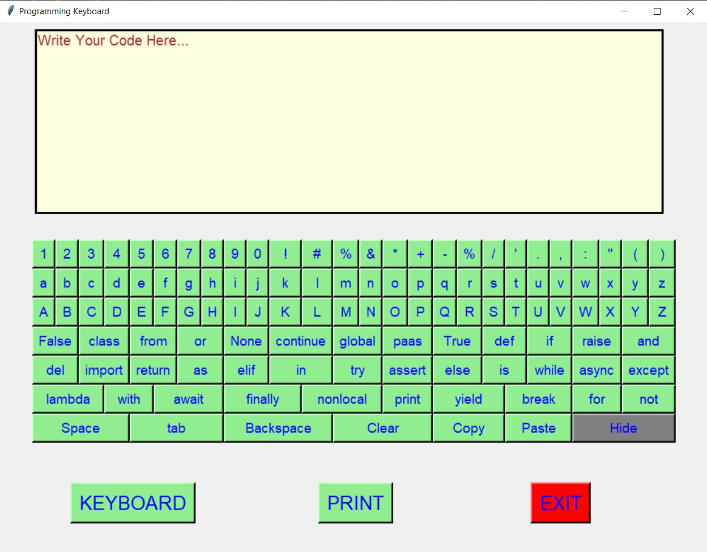
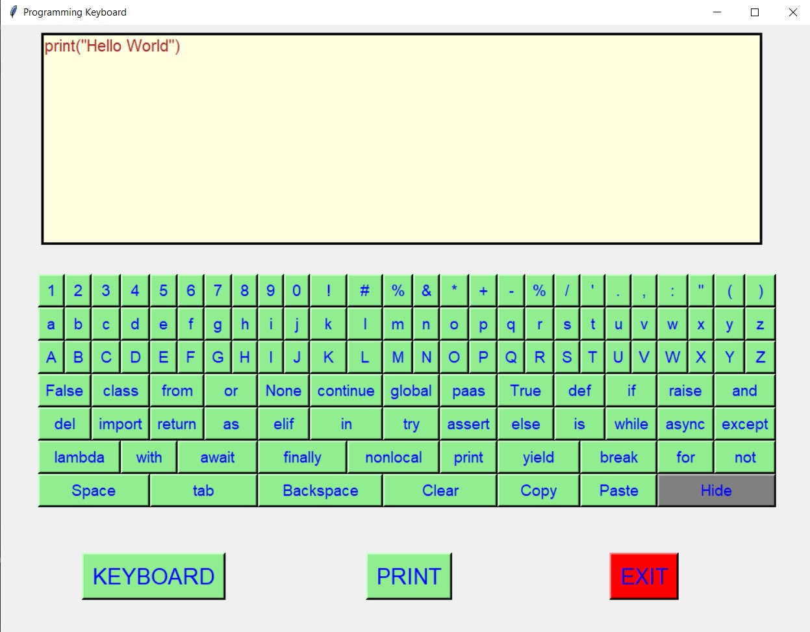
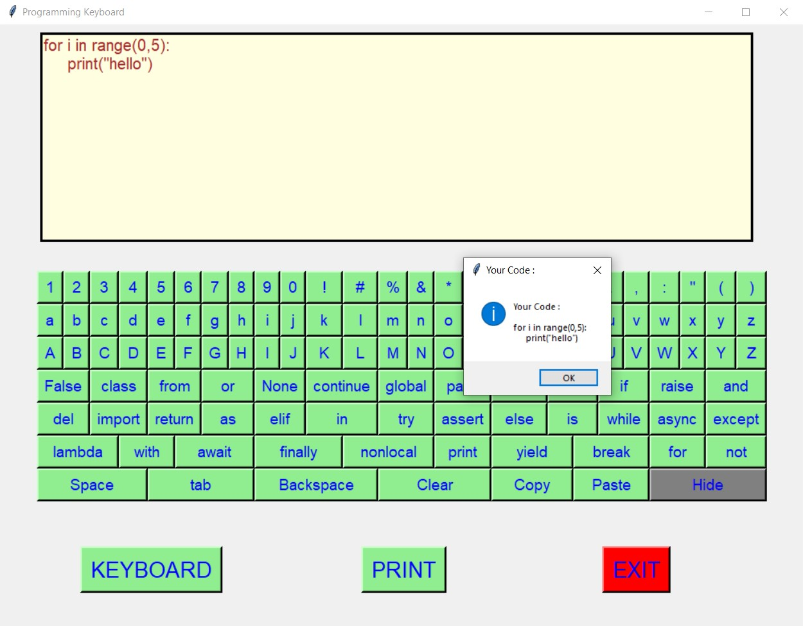
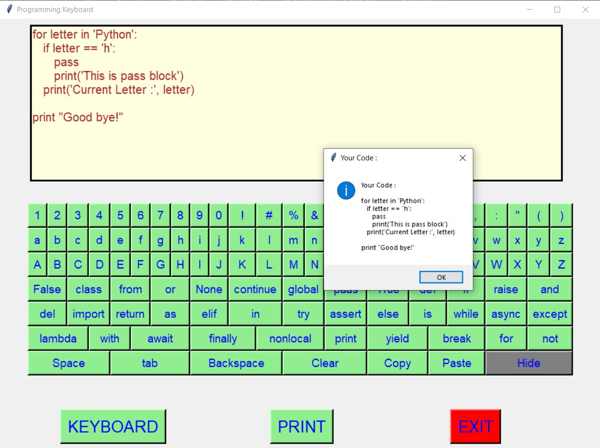
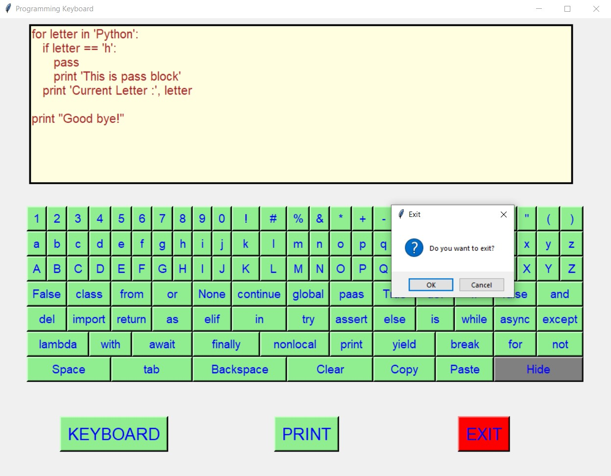

# ✔ PROGRAMMING KEYBOARD
- ### A Programming Keyboard is an application created in python with tkinter gui.
- ### In this application user can enter any text or sentence or paragraph or any coding keyword of python using the virtual keyboard that is embedded inside keyboard button.
- ### This virtual keyboard can print any character (lower or uppercase), any special characters, digits, or any code snippet in python.
- ### Also there are clear, backspace, space, tab, hide keys also in this virtual keyboard.

****

# REQUIREMENTS :
- ### python 3
- ### tkinter module
- ### from tkinter messagebox module

****

# How this Script works :
- ### User just need to download the file and run the programming_keyboard.py on their local system.
- ### Now on the main window of the application, one START button will be there clicking on which the main window of programming keyboard opens.
- ### In this window there is a text area given, and a button KEYBOARD, clicking on which a programming keyboard will pop up in the same frame.
- ### This programming keyword have all the keyword in python in form of keys.
- ### using this virtual keyboard user can enter any text, character, any special charater, digits, and all python keywords. 
- ### Inside Keyboard also there is a clear, backspace, space, tab button also.
- ### Also there is one hide button, clicking on which the virtual keyboard disappears.
- ### After user has entered some text in textarea using programming keyboard, then clicking on the PRINT button, shows messagebox, showing what is printed.
- ### Also there is an exit button, clicking on which exit dialog box appears asking for the permission of the user for closing the window.

# Purpose :
- ### This programming keyboard will help us to write python code easily, by clicking only limited keys in keyboard.

# Compilation Steps :
1. Clone/Download this repository
```
git clone clone_path
```
2. Install the requirements using the command
```
pip install -r requirements.txt
```
3. Run the program using command
```
python programming_keyboard.py
```
****

# SCREENSHOTS :

****

<p align="center">
  <br>
  <br>
  <br>
  <br>
  <br>
  <br>
  <br>
  <br>
</p>

****

