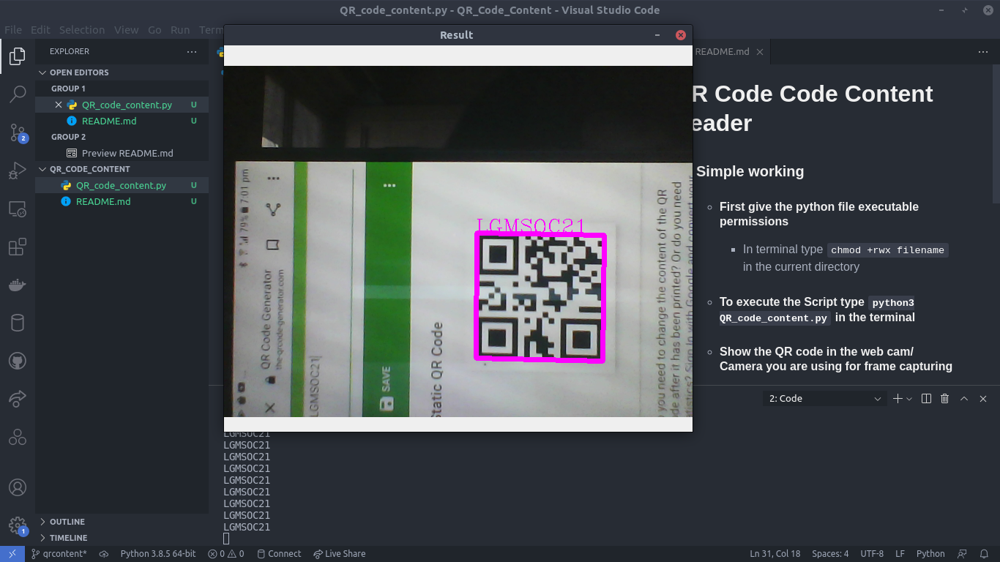

# QR Code Code Content Reader

## About Script

#### This Script detects the QR code present in your derired video stream or image and decode its content to display over the image and it also copies that info to your clipboard

- ## Requirements

  - #### Python 3
  - #### OpenCV
  - #### PyperClip
  - #### Pyzbar
  - #### Numpy

  #### To install these Dependencies use `pip install [module_name]`

- ## How Script Works
  - #### First give the python file executable permissions
    - In terminal type `chmod +rwx filename` in the current directory
  - #### To execute the Script type `python3 QR_code_content.py` in the terminal
  - #### Show the QR code in the web cam/ Camera you are using for frame capturing
    <b>Or</b>
  - #### If you have Picture of QR code on your local storage you can type `python3 QR_code_content.py "[filename]"`
  - #### To stop the camera use or to close the window along with pasting the result on your clipboard and terminal press `C`.
  - #### To change the input device as external connected cameras change line `12` of Code

## Output Screenshot

