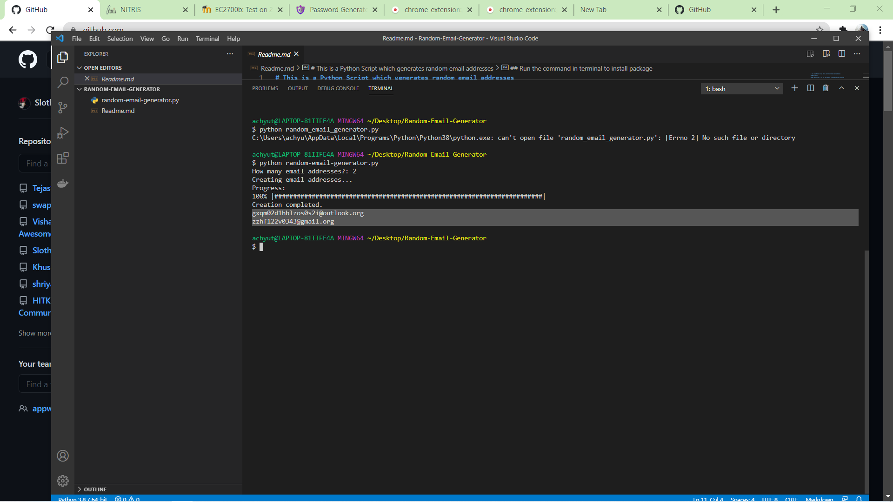

## Description
 This is a Python Script which generates random email addresses and it also asks you how many email ids you want to generate

### Requirements
 For this script to run you need to have progressbar package installed.

### Run the command in terminal to install progressbar package
```
$ pip install progressbar
```
### Run the program using command
``` 
$ python random-email-generator.py
```

### Screenshot
