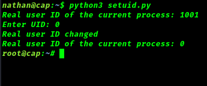

# Get root Privilege in user terminal

## Introduction
```
Privilege-escalation-via-setuid only if you have setuid capabilities on python.

This is a python tool which reset the setuid to the any id you want

```
## Third-Party Libraries Required :
```
No extra libraries are required.
```
## How to use it :
1. Download or clone the repository
2. Run setuid.py
3. Give the UID

## Output

