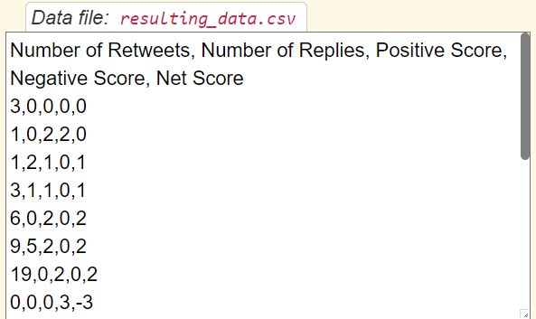
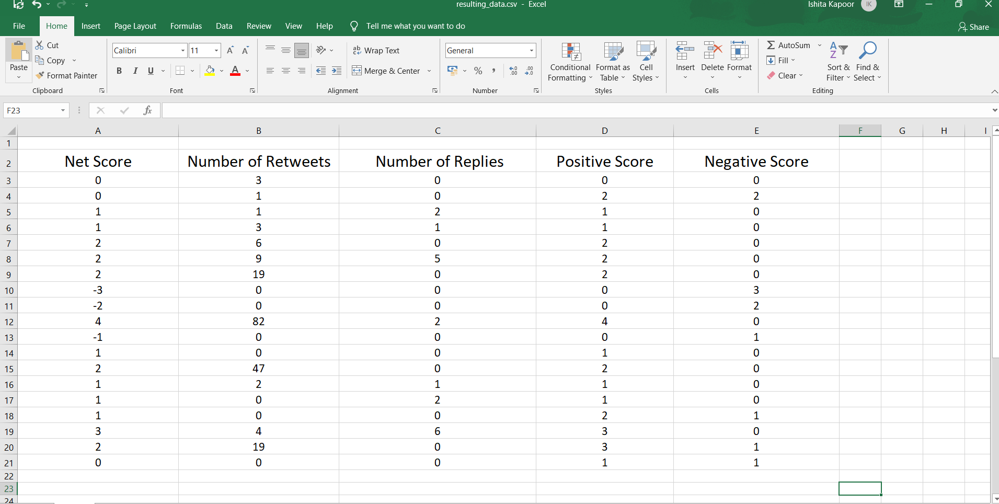
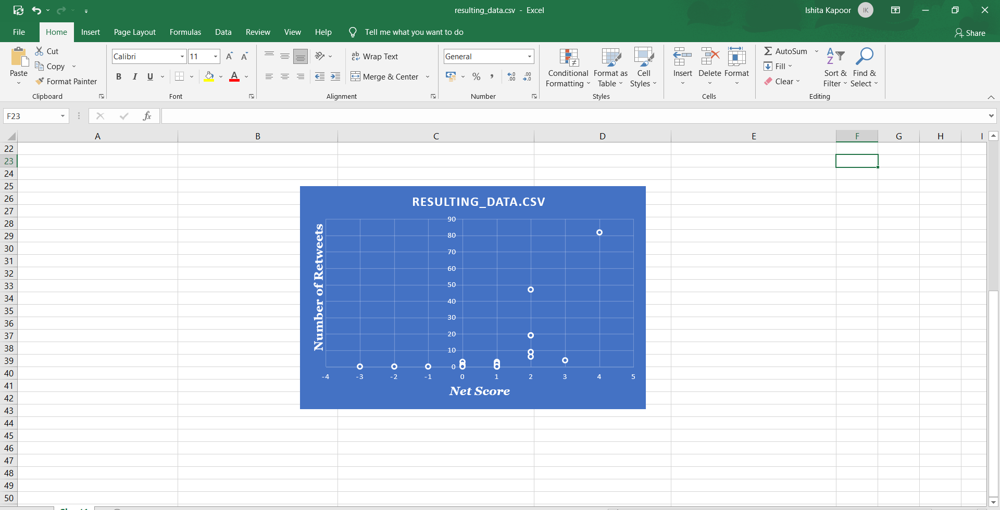

# Sentiment Classifier

## Introduction

A Sentiment Classifier is a program which will detect how positive or negative each tweet is. Also I will add a csv file, which contains columns for the Number of Retweets, Number of Replies, Positive Score (which is how many happy words are in the tweet), Negative Score (which is how many angry words are in the tweet), and the Net Score for each tweet. At the end, I will upload the csv file to Excel or Google Sheets, and produce a graph of the Net Score vs Number of Retweets.

***

## Output Image
 

 
 

 
 

 
 
## How to use: 

1. Run the script.
1. Get the desired result.
1. Use the obtained result to generate a graph.