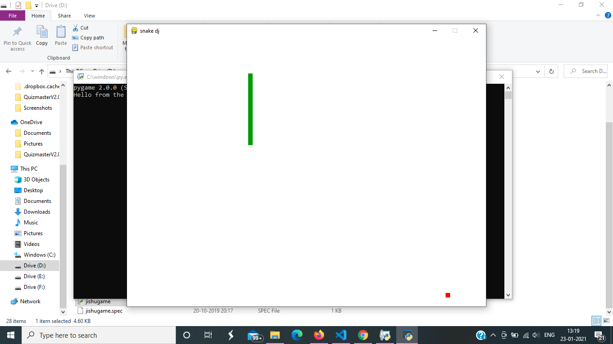
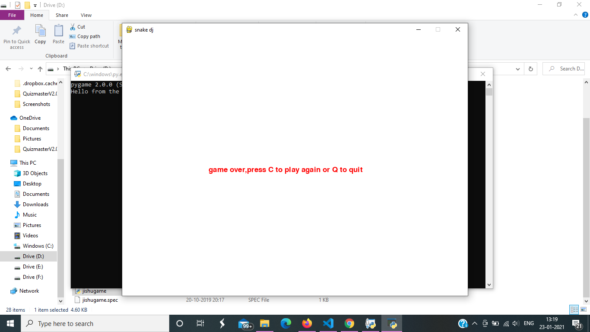

## Snake game using Python.
- ### Installing necessary packages
```bash
pip install pygame
```
- ### Playing the game
Use arrow keys to control the snake. If the snake collides with wall or bites itself, then the game will be over. Press C to play again and Q to quit.

- ### Tutorial credit
I would like to thank [thenewboston](https://www.youtube.com/channel/UCJbPGzawDH1njbqV-D5HqKw) for his awesome pygame tutorial. 

- ### Screenshots



