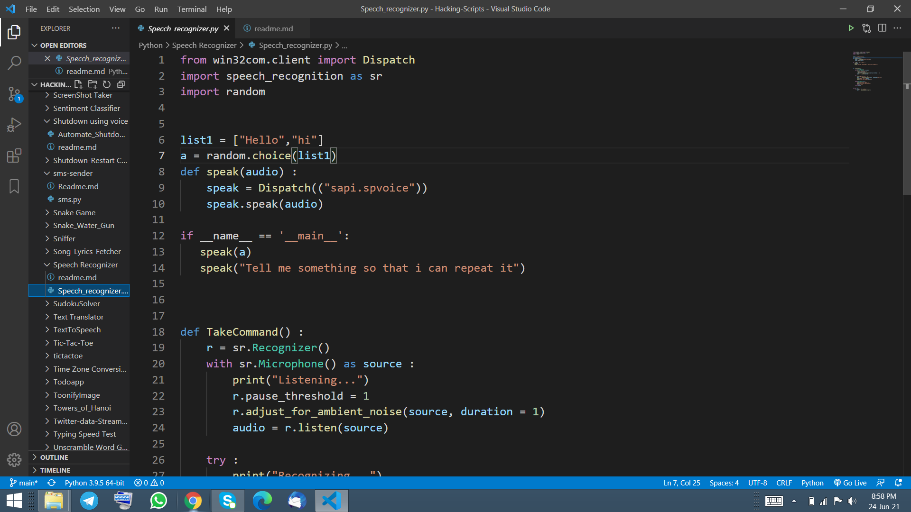

## Introduction
If you want to speak with your machine you can use this program to do the job for you.
It is a simple programme but you can customize it based on your prefernces.

## How to install library
pip install pywin32
pip install SpeechRecognition
pip install random

## How to use
1. You has to install all the library mentioned above.
2. Run this programme in your command prompt or any terminal.
3. Tell something near your microphone.
4. Machine will repeat it for you.

## Output

