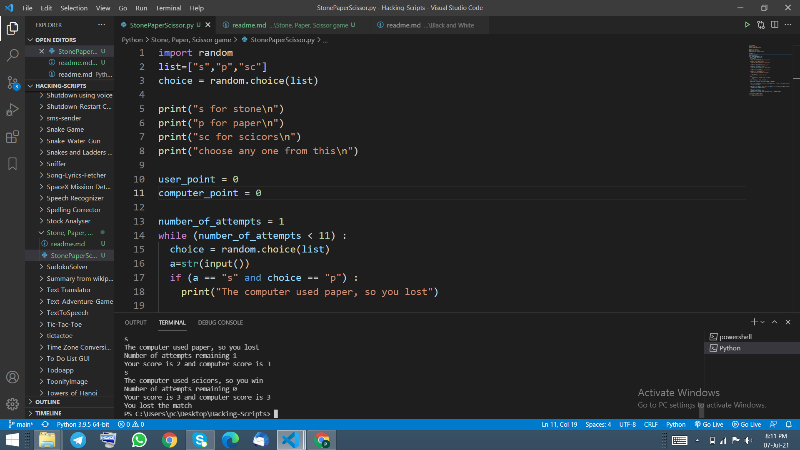

## Introduction
If you feel board while you are coding and you feel like playing some kind of game, then this is the best game which will entertain you as well as it gives the memory of your childhood.

## How to install library
pip install random

## How to use
1. You has to install all the library mentioned above.
2. Run this programme in your command prompt or any terminal.
3. The computer will ask input from the user and you has to provide the correct input otherwise it will show that you have enterd wrong input.
4. Computer will make its turn and it will show the result in the screen.
5. In the end it will show the who have won the game and what is the score of winner.

## Output

