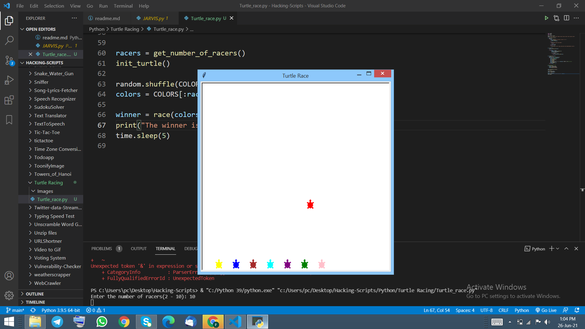
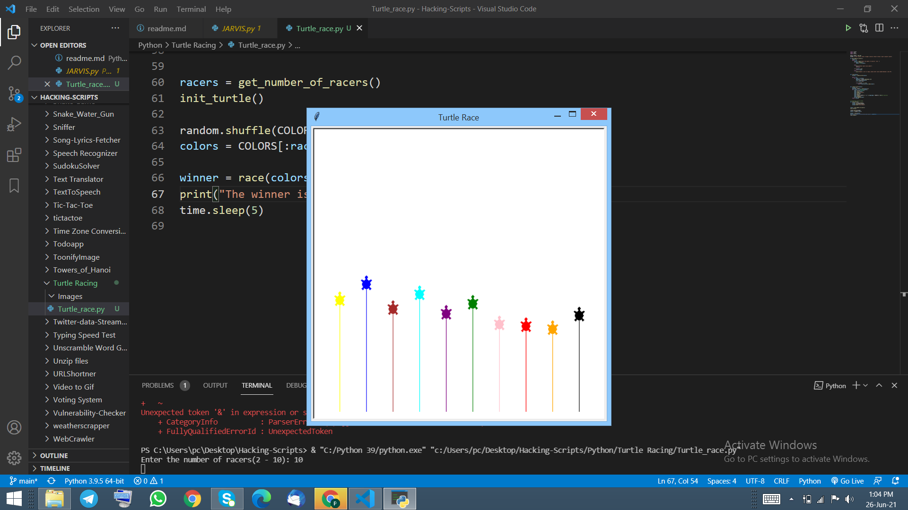
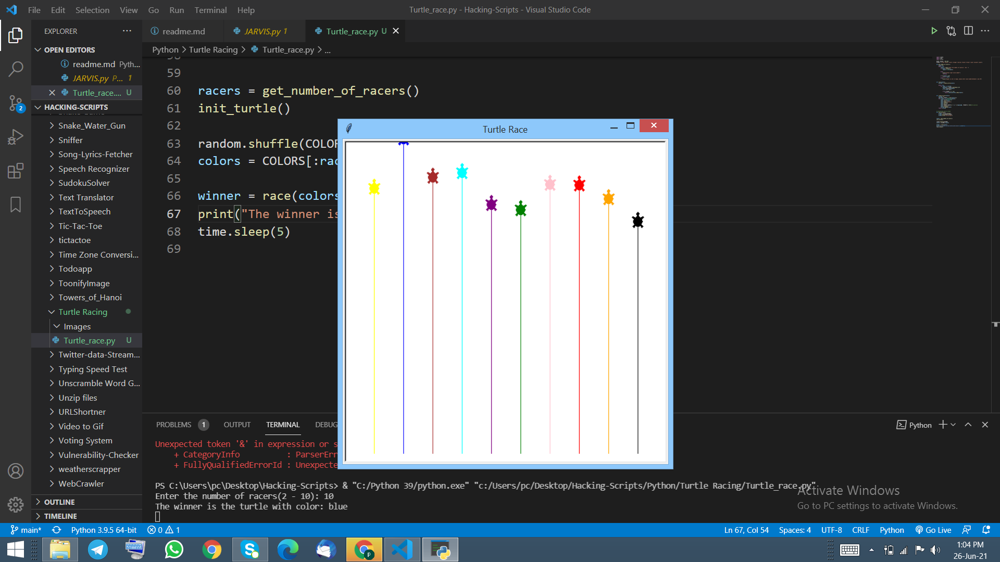

## Introduction
This programme is used to make race between the turtles using turtle module in python.

## How to install library
pip install random
pip install turtle
pip install time

## How to use
1. You has to install all the library mentioned above.
2. Run this programme in your command prompt or any terminal.
3. User has to input the valid number of turtle that he/she wishes to race.
4. After specifying the number of turtle you can see turtle race window appearing in your screen and turtle move randomly in the screen.
5. In the end, the turtle that has reached the finish line first is mentioned in the terminal as the winner of the race.

## Output

