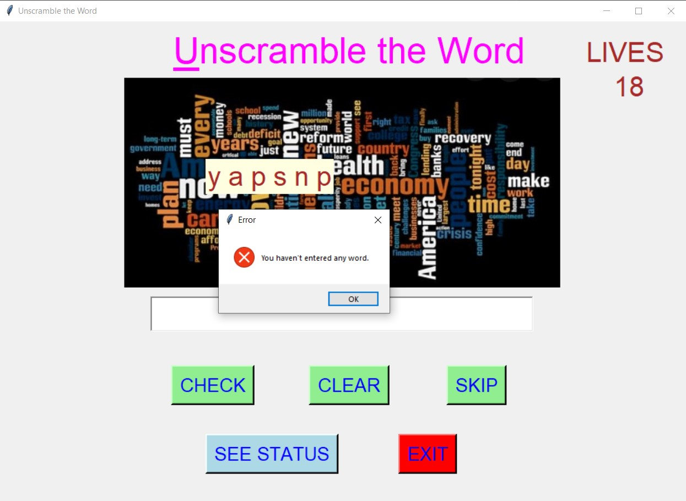

# ✔ UNSCRAMBLE WORD GAME
- ### A Unscramble Word Game created in python with tkinter gui.
- ### In this game, the user will get upto 20 unscrambled words, and he need to enter the correct word for each unscrambled word in just single chance.
- ### for the list of alphabets, used the big_words.csv dataset and read the data from there and used as the questions.

****

# REQUIREMENTS :
- ### python 3
- ### tkinter module
- ### from tkinter messagebox module
- ### PIL module
- ### random

****

# How this Script works :
- ### User just need to download the file and run the unscramble_word.py on their local system.
- ### Now on the main window of the game the user given an unscrambled word, and given a space to enter the correct word for that unscrambled word.
- ### After entering the word, and user click on check button, he will get the message whether ans is correct or not.
- ### If ans is correct the score increases by 1 points, else wrong answer count increases by 1.
- ### If the player skips the current unscrambled word in then his skipped answer count increases by 1.
- ### There is also 20 Lives for player, and when the 20 lives are over the game will over.
- ### Also there is a clear button, clicking on which user can clears the word player has entered.
- ### Also there is an exit button, clicking on which exit dialog box appears asking for the permission of the user for closing the window.
- ### Also there is a skip button, clicking on which player can skip that particular question.
- ### Also there is a see status button, clicking on which player can any time see that he had how many correct , wrong and skipped answers.
- ### At last when game overs, we are able to see the score in the new frame.

****

# SCREENSHOTS :

****

   
   
   
   
   
   
   
   
   

****
