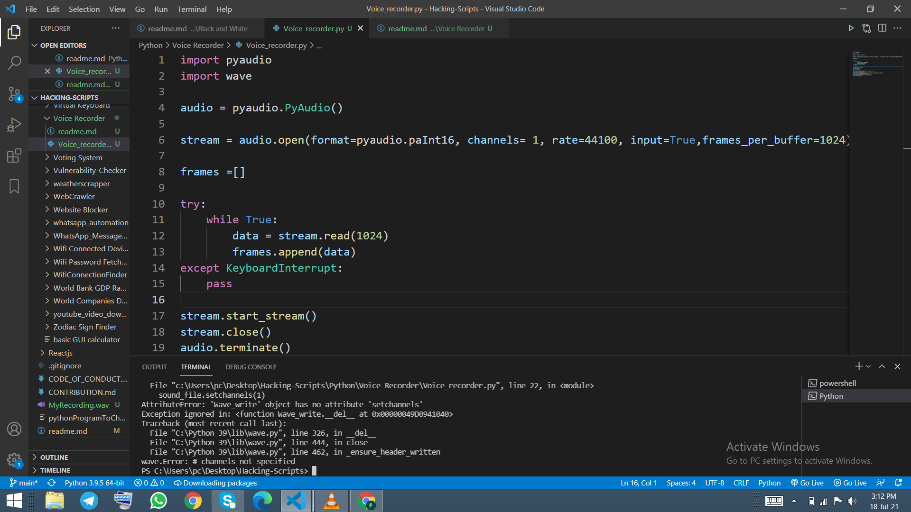

## Introduction
This programme that will help you to recorder your voice and you can use this for your personal work.

## How to install library
pip install pyaudio
pip install wave

## How to use
1. You has to install all the library mentioned above.
2. Run this programme in your command prompt or any terminal.
3. Once fou finished with recording, inorder to end recording create a keyboard interupt for example "Ctr+c".
4. Open the file by double clicking the file and you can find your recording.

## Output

