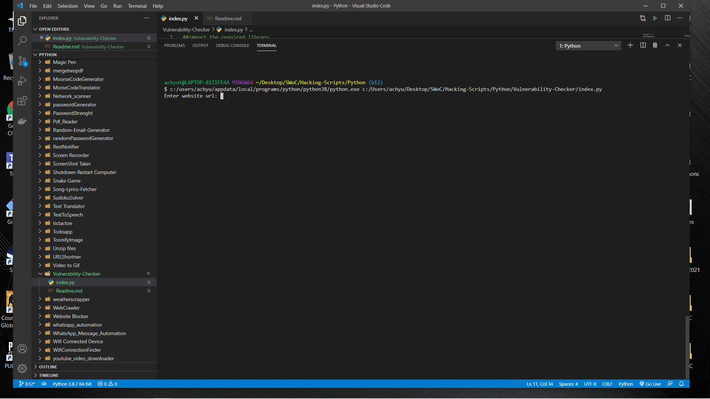
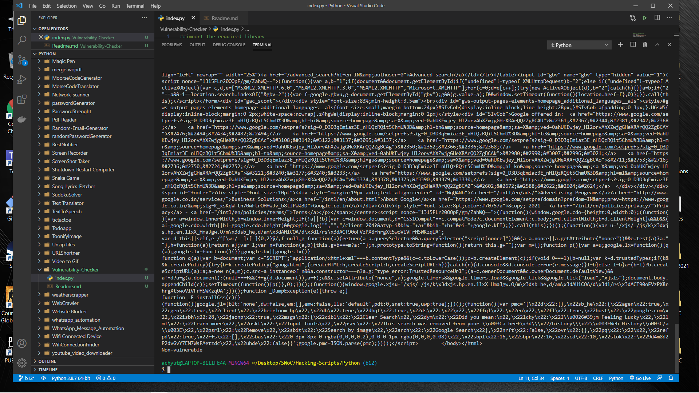

# Vulnerability Checker

## Functionalities : 🚀

- Gives HTML code of the entered website(url)
- Sends requests to the website
- Prints whether the website is vulnerable or not

## Instructions to be followed : 👨🏻‍💻

### Step 1:

    Open Termnial 💻

### Step 2:

    Locate to the directory where python file is located 📂

### Step 3:

    Run the command: python script.py/python3 index.py 🧐

### Step 4:

    Enter the url of the website whose vulnerability is to be checked

## Screenshots

<!--The last line prints wether the site is vulnerable or not-->

