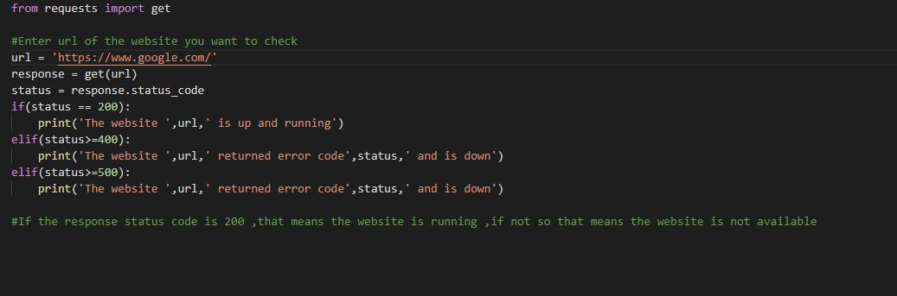
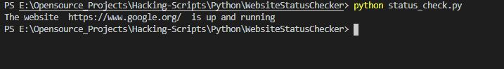
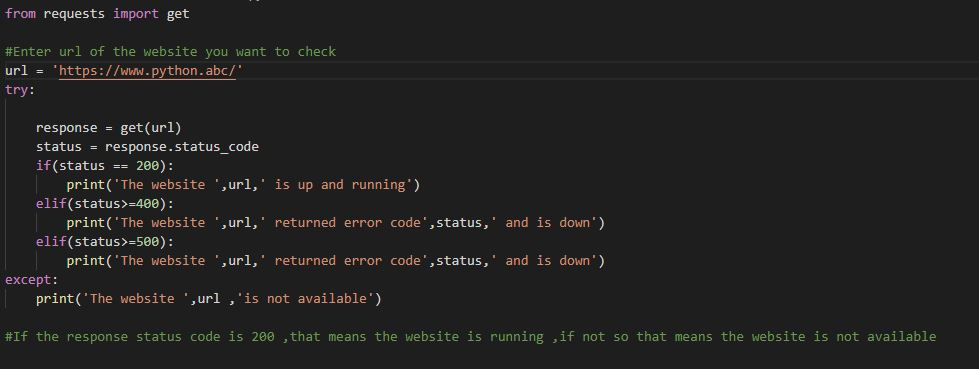
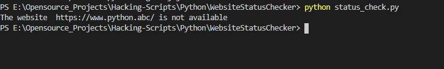

# Website Status Checker

This script returns the status of a given website or webpage based on response status code.

## Steps to make it run

1. Clone/Download this repository
2. Install the requirements using the command
```
pip install -r requirements.txt
```
3. Change the url in the python file to the url of the webpage you want to check
4.Run and see the result

## Inputs and Outputs
Checking https://www.google.com/





Checking https://www.python.abc/




