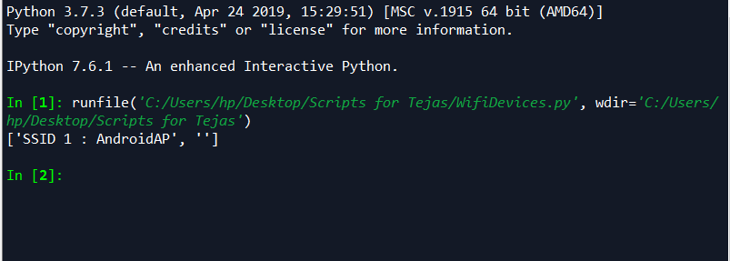

# 
  Python Script to find all devices connected to user's WiFi/HotSpot

## Introduction: 
This simple Python script aims to find all the devices (phones and computers) that are connected to the user's WiFi, by making use of the `netsh wlan show network` command in Python. In order to achieve that utility, we will be using the inbuilt `subprocess` library of Python3. 

## Third-party libraries required:
`subprocess` Library of Python only
## Importing the Library:
On the console, type `import subprocess`
## Running the Script:
After opening the script in your Python IDE, execute the code so that you get the console output window. 
The script will print the SSIDs and usernames of all the connected devices. The SSID is the name of wireless network consisting of unique 32 alphanumeric characters for each user.
## Basic Terminologies:
>`netsh`: is a command-line scripting utility that allows you to display or modify the network configuration of a computer that is currently running.  
>`wlan`: command that allows you to access the Wi-Fi profiles.  
>`network`: the unique name of wireless network. 
## Output:
 

