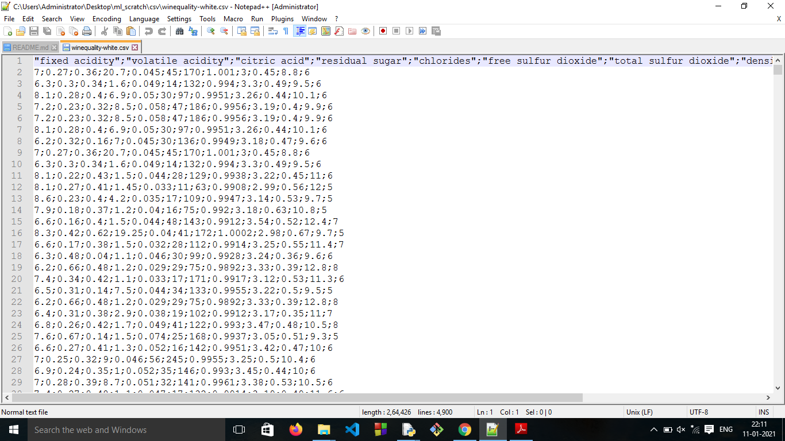

# convert_csv_to_markdown_table

- The script **csv_to_md.py** will take path of the csv file and type of the delimeter in csv file as an input and creates 
a markdown table in a .md file at the same location

- It is flexible with the type of delemiter

## Setup instructions:

- It requires only python to be installed.
- Doesn't requires any external libraries.

## Example output:

It takes a csv file like this as an input 

and converts it into a markdown table in an .md file of the same name like this.
 

## Author:

[Mohta Rahul Suresh](https://github.com/Rahul555-droid)
