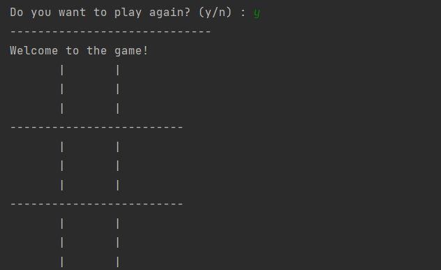
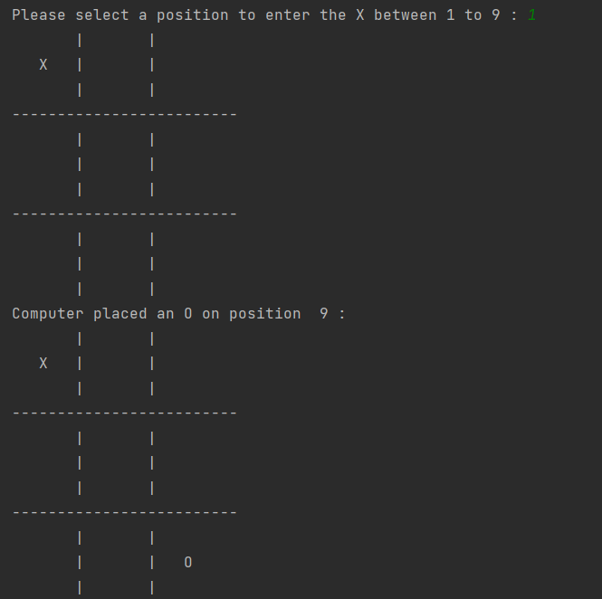
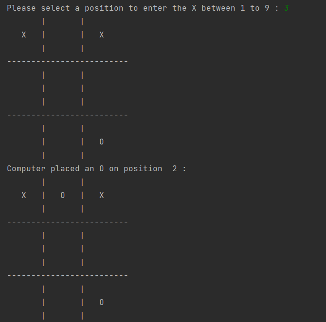
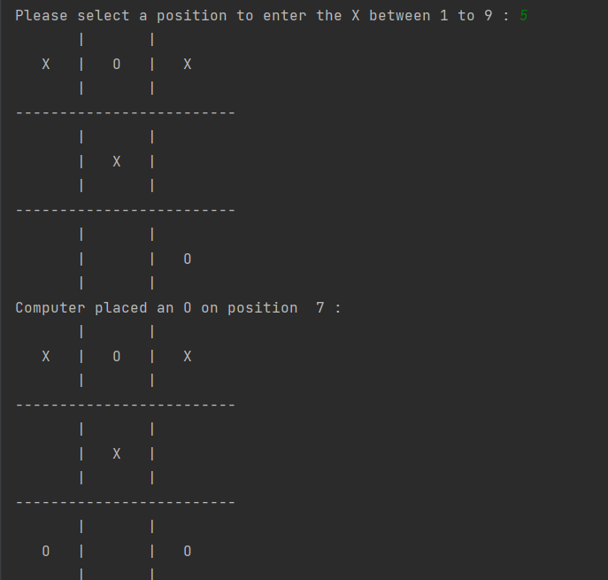
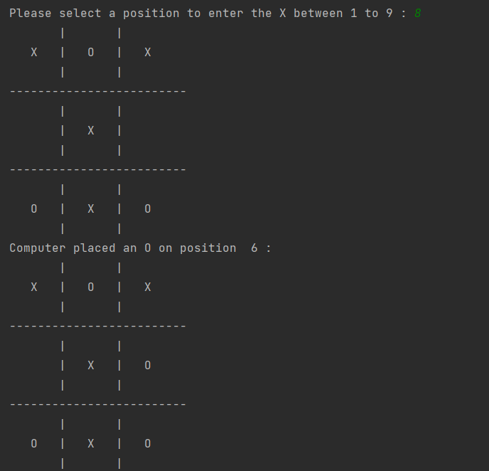
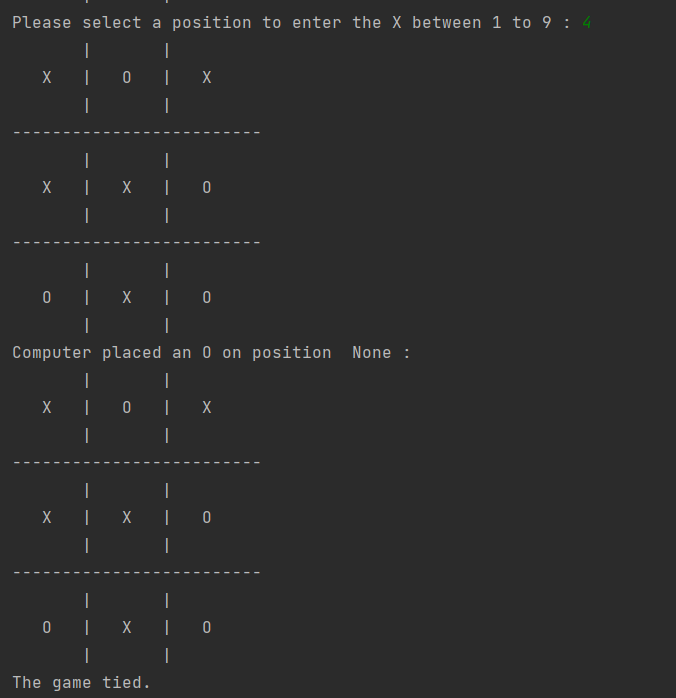
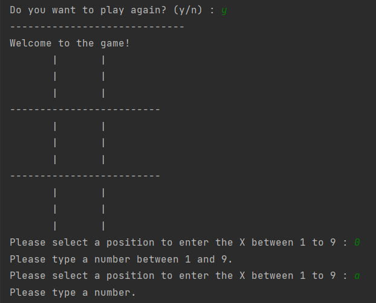
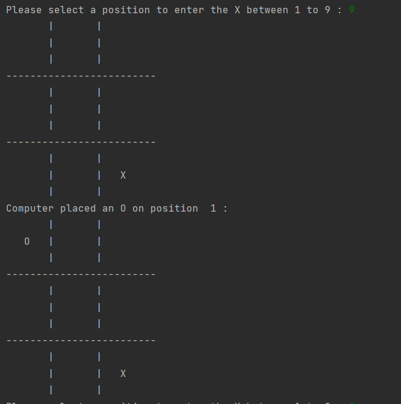
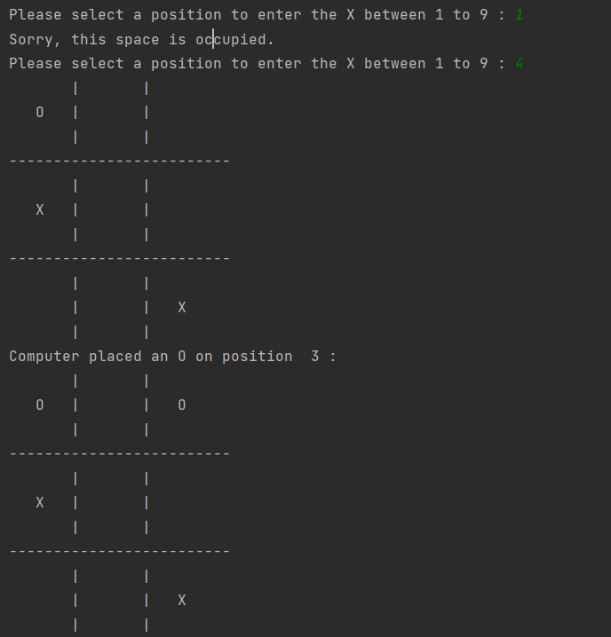
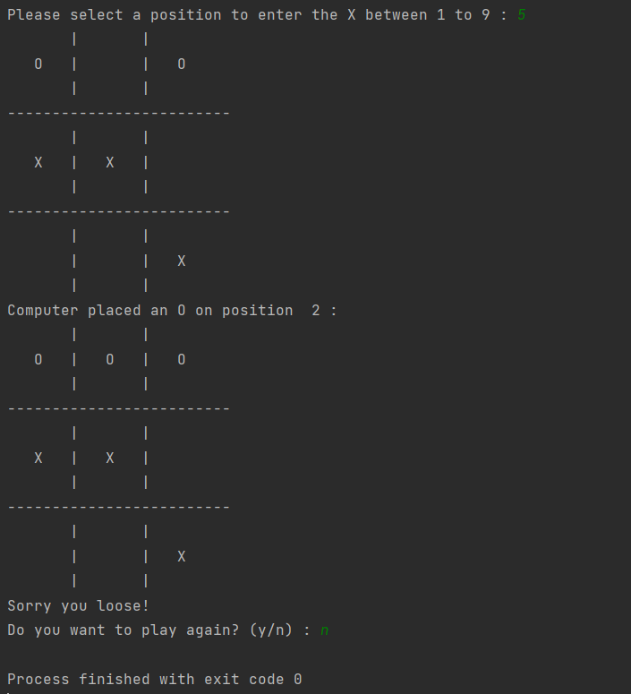

# ✔ TIC TAC TOE
- ### A TIC TAC TOE game created in python.
- ### The game is single player mode and player need to play against computer.
- ### Here the player move is done manually by player, and the computer move is according to the optimal method defined in the code.

****

   
   
   
   
   
     
   
   
   
   

****