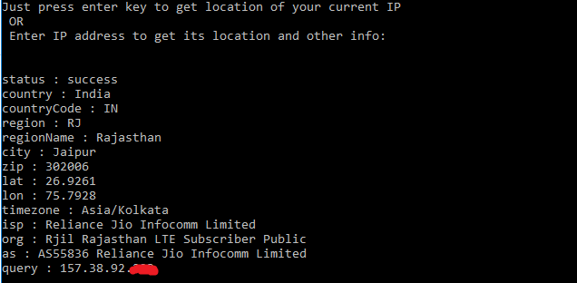
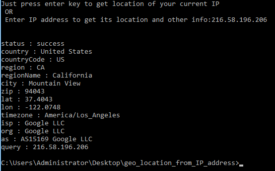

# Script to get Geo location and other Info from an IP adress

- The script **info_ip.py** will take an IP address as an input and give all the information about the IP adress 
including geographical location,ISP,lat,lon,etc.

## Setup instructions:

- It requires only python to be installed 
- it uses a public API from the site http://www.ip-api.com/json/ and a network connection!

## Example output:

If you will just press Enter key or no input you will get the info about your current IP address.

OR

If you enter an IP address you will get the info about it

## Author:

[Mohta Rahul Suresh](https://github.com/Rahul555-droid)
