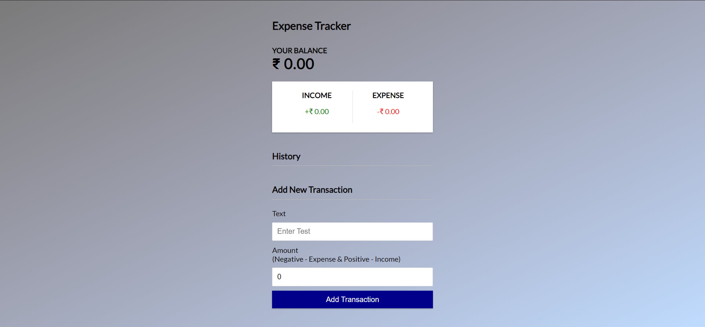
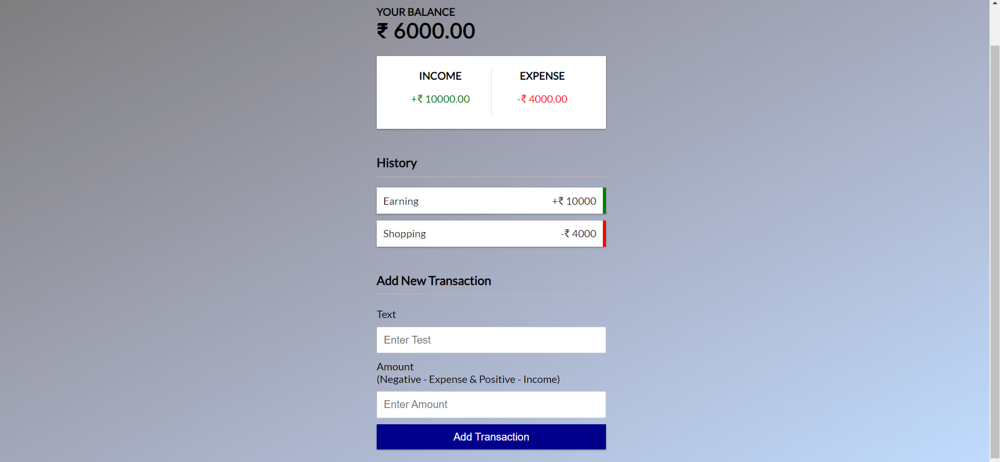

# Expense Tracker

## Introduction

An Expense tracker built using React Js in which you can track your expenses by adding and removing them

## Third-Party Libraries Required :
    react
    react-dom
    react-scripts
    web-vitals
    
## How to install the above Library

<li>Fork the repo</li>
<li>Clone it to your system</li>
<li>Type the following commands in your terminal</li><br/>

```
cd Expense Tracker
```
```
npm install
```
## How to use it :

<li>Type the following commands in your terminal</li><br/>

```
npm start
```
Open [http://localhost:3300/](http://localhost:3300/) to see the result. Make any edits if required.

<h1>Output</h1>
<p align="center">
  <br/>
  
</p>
